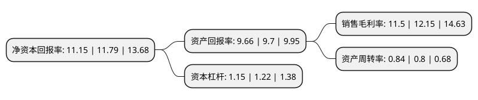

> 本页面由自动化程序生成于 2022年5月20日 01:32
> 内容可能存在错误，如有bug请提交issue至：https://github.com/Eroleice/doc-pi/issues
{.is-warning}

# 上市公司基本情况

## 基本资料

千禾味业食品股份有限公司（以下简称“千禾味业”）成立于1996年01月31日，眉山市。于2016年03月07日在上交所主板上市。

千禾味业注册资本79,878.216万元，专业从事酱油，食醋等调味品和焦糖色等食品添加剂的研发，生产和销售。公司形成了以酱油，食醋等为主的调味品产品和以焦糖色为主的食品添加剂产品系列。以下是详细信息：

- 公司名称: 千禾味业食品股份有限公司
- 股票代码: 603027.SH
- 所在地: 四川 - 眉山市
- 成立日期: 1996年01月31日
- 注册资本: 79,878.216万元
- 法定代表人: 伍超群
- 主营业务: 专业从事酱油，食醋等调味品和焦糖色等食品添加剂的研发，生产和销售公司形成了以酱油，食醋等为主的调味品产品和以焦糖色为主的食品添加剂产品系列
- 公司官网: www.qianhefood.com
- 公司介绍: 公司专业从事酱油、食醋等调味品的研发、生产和销售。目前形成了以酱油、食醋、料酒等为主的调味品产品系列和以焦糖色为主的食品添加剂产品系列。公司是全国农产品加工业示范企业，国家级两化融合管理体系贯标试点企业，中国调味品协会副会长单位，四川省博士后创新实践基地，四川省级企业技术中心和四川省优秀民营企业。公司的“千禾”牌酱油主要选用非转基因黄豆、非转基因食用大豆粕、有机黄豆、小麦/有机小麦为原料，采用先进的种曲机、管道连续蒸煮、圆盘制曲机等生产设备和工艺，按照高盐稀态发酵工艺，经过长时间发酵而制成纯酿造酱油。公司的“千禾”牌食醋主要采用传统酿造工艺，精选优质糯米、荞麦、小麦、高粱、玉米五种粮食生产的纯酿造食醋，并结合窖藏工艺生产窖醋。“千禾”商标是四川省著名商标，千禾牌酿造酱油、食醋为四川省名牌产品。公司是国内主要的焦糖色生产企业，“恒泰”商标是中国驰名商标。

## 股东及高管情况

上市公司第一大股东为伍超群，持股296,300,736股，占比37.09%，为上市公司实际控制人。

截至2022年03月31日，上市公司的前十大股东中，共有3名自然人股东，6个产品账户，1个海外主体，其中5%以上大股东共有2名。上市公司前十大股东明细如下：

> 截至2022年03月31日，上市公司前十大股东信息如下：

| 股东名称 | 持股数量（股） | 持股比例 |
| --- | --- | --- |
| 伍超群 | 296,300,736 | 37.09% |
| 伍建勇 | 78,491,957 | 9.83% |
| 香港中央结算有限公司(陆股通) | 12,441,860 | 1.56% |
| 全国社保基金一一七组合 | 11,129,125 | 1.39% |
| 前海人寿保险股份有限公司-分红保险产品华泰组合 | 11,000,000 | 1.38% |
| 伍学明 | 7,433,307 | 0.93% |
| 中国工商银行股份有限公司-华安媒体互联网混合型证券投资基金 | 5,114,860 | 0.64% |
| 中国建设银行股份有限公司-华安沪港深外延增长灵活配置混合型证券投资基金 | 4,357,800 | 0.55% |
| 基本养老保险基金一二零六组合 | 4,320,200 | 0.54% |
| 中国农业银行股份有限公司-华安智能生活混合型证券投资基金 | 4,282,220 | 0.54% |

## 利润表分析

上市公司2021年总收入为19.25亿元，净利润为2.21亿元，实现盈利。

## 杜邦分析

> 数据列示周期：2021年 | 2020年 | 2019年
{.is-info}

上市公司的净资产收益率在近一年有所下降，下降幅度为-5.43%，其变化情况分解如下：
- 上市公司的销售毛利率在近一年下降了-5.35%，可能是生产效率的下降、商品原材料价格上涨或商品价格的下跌所致。
- 上市公司的资产周转率在近一年上升了5%，可能是源自于更快的销售回款或库存管理效果提升。
- 上市公司的财务杠杆比率在近一年下降了-5.74%，可能是减少负债降低财务费用。

