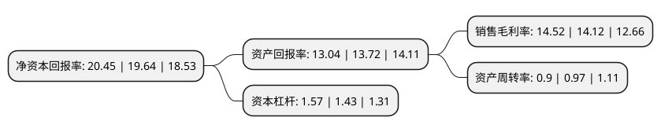

> 本页面由自动化程序生成于 2022年5月20日 01:32
> 内容可能存在错误，如有bug请提交issue至：https://github.com/Eroleice/doc-pi/issues
{.is-warning}

# 上市公司基本情况

## 基本资料

广州酒家集团股份有限公司（以下简称“广州酒家”）成立于1992年05月11日，广州市。于2017年06月27日在上交所主板上市。

广州酒家注册资本56,722.404万元，公司主营业务分两大板块，分别为食品制造业务板块及餐饮业务板块，并以食品制造业务为主。公司主要产品:烘焙食品，速冻食品，腊味食品，餐饮服务。以下是详细信息：

- 公司名称: 广州酒家集团股份有限公司
- 股票代码: 603043.SH
- 所在地: 广东 - 广州市
- 成立日期: 1992年05月11日
- 注册资本: 56,722.404万元
- 法定代表人: 徐伟兵
- 主营业务: 公司主营业务分两大板块，分别为食品制造业务板块及餐饮业务板块，并以食品制造业务为主公司主要产品:烘焙食品，速冻食品，腊味食品，餐饮服务
- 公司官网: www.gzr.com.cn
- 公司介绍: 公司主要业务有餐饮服务和食品工业，企业被国家商务部评为“中国十大餐饮品牌企业”，先后获得“中华老字号”、“全国用户满意服务企业”、“全国精神文明建设先进单位”、“全国五一劳动奖状”等荣誉，2012年更荣获了“中国驰名商标”称号。广州酒家集团拥有众多高级烹调、面点和服务大师，不断致力于发掘传统粤菜文化和创新菜品服务，先后推出“满汉大全筵”、“五朝华筵”和“南越王宴”等仿古宴席而备受赞誉。并大力发展食品工业，1998年建成大型现代化食品生产基地——利口福食品有限公司，通过了ISO9000、HACCP、QS、绿色食品等认证，拥有专业的技术研发与食品检测中心和多条先进生产流水线，生产中秋月饼、速冻食品、秋之风腊味、西饼面包、方便食品等八大系列上百个品种。其中中秋月饼更成为广式月饼的龙头，位居全国三甲，获“中国名牌产品”称号、“绿色食品”标志。“广州酒家”、“利口福”、“秋之风”等商标被评为“广东省著名商标”。

## 股东及高管情况

上市公司第一大股东为广州市城市建设投资集团有限公司，持股288,453,276股，占比50.85%，为上市公司实际控制人。

截至2022年05月12日，上市公司的前十大股东中，共有3名自然人股东，2名机构股东，1个产品账户，1个海外主体，3名其他股东，其中5%以上大股东共有5名。上市公司前十大股东明细如下：

> 截至2022年05月12日，上市公司前十大股东信息如下：

| 股东名称 | 持股数量（股） | 持股比例 |
| --- | --- | --- |
| 广州市城市建设投资集团有限公司 | 288,453,276 | 50.85% |
| 广州市城市建设投资集团有限公司 | 288,453,276 | 50.85% |
| 广州市人民政府国有资产监督管理委员会 | 56,142,814 | 9.9% |
| 广东省财政厅 | 38,288,454 | 6.75% |
| 广州市人民政府国有资产监督管理委员会 | 29,914,193 | 5.3% |
| 香港中央结算有限公司(陆股通) | 16,529,586 | 2.91% |
| 温祈福 | 5,367,429 | 0.95% |
| 林杏绮 | 3,618,042 | 0.64% |
| 吴家威 | 3,067,666 | 0.54% |
| 深圳佳岳投资管理有限公司-佳岳-实投2号私募证券投资基金 | 2,870,646 | 0.51% |

## 利润表分析

上市公司2021年总收入为38.89亿元，净利润为5.64亿元，实现盈利。

## 杜邦分析

> 数据列示周期：2021年 | 2020年 | 2019年
{.is-info}

上市公司的净资产收益率在近一年有所上升，上升幅度为4.12%，其变化情况分解如下：
- 上市公司的销售毛利率在近一年上升了2.83%，可能是生产效率的提升、商品原材料价格下跌或商品价格的上涨所致。
- 上市公司的资产周转率在近一年下降了-7.22%，可能是源自于更慢的销售回款或库存管理效果下降。
- 上市公司的财务杠杆比率在近一年上升了9.79%，可能是增加负债扩大生产规模。

