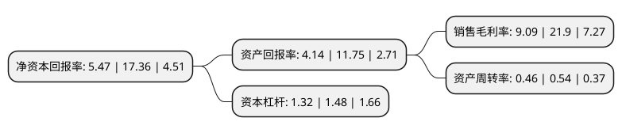

> 本页面由自动化程序生成于 2022年5月20日 01:32
> 内容可能存在错误，如有bug请提交issue至：https://github.com/Eroleice/doc-pi/issues
{.is-warning}

# 上市公司基本情况

## 基本资料

浙江圣达生物药业股份有限公司（以下简称“圣达生物”）成立于1999年02月08日，台州市。于2017年08月23日在上交所主板上市。

圣达生物注册资本17,118.896万元，主要从事食品和饲料添加剂的研发，生产及销售，产品主要包括生物素叶酸等维生素类产品和乳酸链球菌素，纳他霉素等生物保鲜剂。以下是详细信息：

- 公司名称: 浙江圣达生物药业股份有限公司
- 股票代码: 603079.SH
- 所在地: 浙江 - 台州市
- 成立日期: 1999年02月08日
- 注册资本: 17,118.896万元
- 法定代表人: 洪爱
- 主营业务: 主要从事食品和饲料添加剂的研发，生产及销售，产品主要包括生物素叶酸等维生素类产品和乳酸链球菌素，纳他霉素等生物保鲜剂
- 公司官网: www.sd-pharm.com
- 公司介绍: 公司主要从事食品和饲料添加剂的研发、生产及销售，产品包括生物素、叶酸等维生素类产品以及乳酸链球菌素、纳他霉素等生物保鲜剂类，严格按照GMP管理体系组织生产经营工作。同时公司通过了ISO22000、BRC、FAMI-QS、OHSAS18001等国际体系认证。公司是国内最早从事生物素和生物保鲜剂生产的企业之一，系高新技术企业，建有市级院士工作站、省级技术中心及省级研究院，在B族维生素和生物保鲜剂领域分别拥有一支由“浙江省千人计划”和“国家千人计划”领衔的专业研发团队。公司产品竞争力强，是全球最大的生物素供应商，子公司新银象则是全球乳酸链球菌素及纳他霉素的主要供应商之一，是乳酸链球菌素行业标准和纳他霉素国家标准的主要起草单位。公司被授予“中国质量诚信企业”、“浙江省具有成长性中型企业”、“浙江省工业循环经济示范企业”等荣誉称号。

## 股东及高管情况

上市公司第一大股东为浙江圣达集团有限公司，持股45,375,792股，占比26.51%，**疑似为**上市公司实际控制人。

截至2022年03月31日，上市公司的前十大股东中，共有5名自然人股东，5名机构股东，其中5%以上大股东共有3名。上市公司前十大股东明细如下：

> 未能通过持股比例判定出上市公司实际控制人（持股30%以上）
> 可能存在通过间接持股、联合持股、协议控制等方式拥有实际控制权的主体，具体请参考上市公司定期公告！
{.is-warning}

> 截至2022年03月31日，上市公司前十大股东信息如下：

| 股东名称 | 持股数量（股） | 持股比例 |
| --- | --- | --- |
| 浙江圣达集团有限公司 | 45,375,792 | 26.51% |
| 天台万健投资发展中心(有限合伙) | 32,771,141 | 19.14% |
| 浙江鸿博企业管理有限公司 | 12,019,931 | 7.02% |
| 朱勇刚 | 4,092,352 | 2.39% |
| 朱国锭 | 2,745,600 | 1.6% |
| 程书广 | 1,947,300 | 1.14% |
| 浙江银轮机械股份有限公司 | 1,188,800 | 0.69% |
| 北京济安金信科技有限公司 | 796,977 | 0.47% |
| 李铁骥 | 782,800 | 0.46% |
| 詹孙芳 | 668,600 | 0.39% |

## 利润表分析

上市公司2021年总收入为7.89亿元，净利润为0.71亿元，实现盈利。

## 杜邦分析

> 数据列示周期：2021年 | 2020年 | 2019年
{.is-info}

上市公司的净资产收益率在近一年有所下降，下降幅度为-68.49%，其变化情况分解如下：
- 上市公司的销售毛利率在近一年下降了-58.49%，可能是生产效率的下降、商品原材料价格上涨或商品价格的下跌所致。
- 上市公司的资产周转率在近一年下降了-14.81%，可能是源自于更慢的销售回款或库存管理效果下降。
- 上市公司的财务杠杆比率在近一年下降了-10.81%，可能是减少负债降低财务费用。

