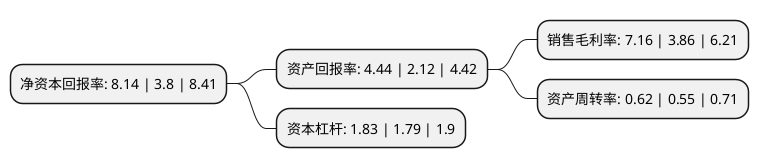

> 本页面由自动化程序生成于 2022年5月20日 01:33
> 内容可能存在错误，如有bug请提交issue至：https://github.com/Eroleice/doc-pi/issues
{.is-warning}

# 上市公司基本情况

## 基本资料

江苏苏盐井神股份有限公司（以下简称“苏盐井神”）成立于2001年04月06日，淮安市。于2015年12月31日在上交所主板上市。

苏盐井神注册资本77,292.655万元，主营业务;本公司从事盐矿的开采，盐及盐化工产品的生产，销售。主要产品:包括食盐，小工业盐，两碱用盐，元明粉和纯碱。以下是详细信息：

- 公司名称: 江苏苏盐井神股份有限公司
- 股票代码: 603299.SH
- 所在地: 江苏 - 淮安市
- 成立日期: 2001年04月06日
- 注册资本: 77,292.655万元
- 法定代表人: 吴旭峰
- 主营业务: 主营业务;本公司从事盐矿的开采，盐及盐化工产品的生产，销售主要产品:包括食盐，小工业盐，两碱用盐，元明粉和纯碱
- 公司官网: www.jsjsyh.com
- 公司介绍: 公司是集科研、生产、配送、销售于一体的全国大型盐及盐化工企业。公司不断深化企业改革，创新管理模式。小包装生产采用全自动装箱、机器人堆码和数码防伪系统，建有江苏(井神)盐化工循环经济技术研究院等技术平台，盐碱钙联合循环生产工艺(核心发明专利)为国内首创。公司践行“创新、协调、绿色、开放、共享”新发展理念，依托江苏(井神)盐化工循环经济技术研究院、省军民融合盐化工循环经济研究中心等研发平台，加强技术创新，推动产业升级。公司作为全国食盐定点生产企业、全国绿色食品示范企业、江苏省盐业动员中心，以建成“中国健康食盐的领航者”为目标，打造符合GMP标准的食盐生产基地，研发生产了海藻碘食盐、绿色食品食盐、深井岩盐、低钠盐、天然日晒盐等系列中高端食盐，保障了江苏及周边省份近亿人的食盐稳定供应。公司生产的“淮”牌系列盐被评为“中国名牌产品”，“井神”商标为江苏省著名商标。

## 股东及高管情况

上市公司第一大股东为江苏省盐业集团有限责任公司，持股491,250,516股，占比63.56%，为上市公司实际控制人。

截至2022年03月31日，上市公司的前十大股东中，共有5名自然人股东，5名机构股东，其中5%以上大股东共有1名。上市公司前十大股东明细如下：

> 截至2022年03月31日，上市公司前十大股东信息如下：

| 股东名称 | 持股数量（股） | 持股比例 |
| --- | --- | --- |
| 江苏省盐业集团有限责任公司 | 491,250,516 | 63.56% |
| 江苏华昌化工股份有限公司 | 12,510,000 | 1.62% |
| 建水新江淮企业管理有限公司 | 11,537,450 | 1.49% |
| 山西省盐业集团有限责任公司 | 3,500,000 | 0.45% |
| 江苏众合创业投资有限公司 | 3,200,000 | 0.41% |
| 胡志光 | 2,676,700 | 0.35% |
| 丁振琴 | 1,871,000 | 0.24% |
| 仲伟霞 | 1,344,300 | 0.17% |
| 曹明 | 1,321,400 | 0.17% |
| 吴林雄 | 1,180,000 | 0.15% |

## 利润表分析

上市公司2021年总收入为47.61亿元，净利润为3.4亿元，实现盈利。

## 杜邦分析

> 数据列示周期：2021年 | 2020年 | 2019年
{.is-info}

上市公司的净资产收益率在近一年有所上升，上升幅度为114.21%，其变化情况分解如下：
- 上市公司的销售毛利率在近一年上升了85.49%，可能是生产效率的提升、商品原材料价格下跌或商品价格的上涨所致。
- 上市公司的资产周转率在近一年上升了12.73%，可能是源自于更快的销售回款或库存管理效果提升。
- 上市公司的财务杠杆比率在近一年上升了2.23%，可能是增加负债扩大生产规模。

