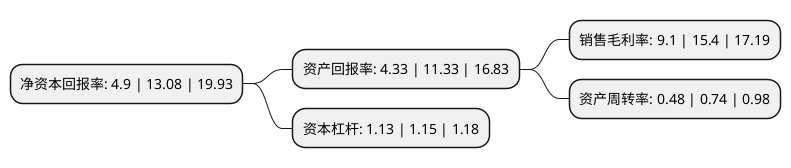

> 本页面由自动化程序生成于 2022年5月20日 01:33
> 内容可能存在错误，如有bug请提交issue至：https://github.com/Eroleice/doc-pi/issues
{.is-warning}

# 上市公司基本情况

## 基本资料

四川天味食品集团股份有限公司（以下简称“天味食品”）成立于2007年03月02日，成都市。于2019年04月16日在上交所主板上市。

天味食品注册资本75,418.169万元，主营业务为川味复合调味料的研发，生产和销售，主要产品包括火锅底料，川菜调料，香肠腊肉调料等三大产品系列。以下是详细信息：

- 公司名称: 四川天味食品集团股份有限公司
- 股票代码: 603317.SH
- 所在地: 四川 - 成都市
- 成立日期: 2007年03月02日
- 注册资本: 75,418.169万元
- 法定代表人: 邓文
- 主营业务: 主营业务为川味复合调味料的研发，生产和销售，主要产品包括火锅底料，川菜调料，香肠腊肉调料等三大产品系列
- 公司官网: www.teway.cn
- 公司介绍: 公司是中国调味品协会理事单位、农业产业化国家重点龙头企业。自成立以来，公司一直致力于川味复合调味料的研发、生产和销售，现已自主研发出“大红袍”、“好人家”、“天车”、“羊羊羊”四大系列畅销全国并远销海外的产品。其中，“大红袍”、“好人家”牌川味复合调味料获“四川名牌产品”称号；“天车”商标被中华人民共和国商务部认定为“中华老字号”。公司历来注重规范管理，并先后通过了ISO9001质量管理体系认证、ISO22000食品安全管理体系认证、ISO14001环境管理体系认证以及OHSAS18001职业健康安全管理体系认证。公司是火锅底料、辣椒酱国家标准的起草单位之一，也参与了川式复合调味料、川式佐餐调味料等地方标准的起草。规范的管理、持续的创新也促进了销售的稳定增长。目前公司已在全国三十多个省市自治区建立了完善的销售网络，并在重要区域设置了办事处。随着销售网络全球化战略的实施，产品已远销美国、英国、加拿大、澳大利亚等国家。

## 股东及高管情况

上市公司第一大股东为邓文，持股487,722,000股，占比64.67%，为上市公司实际控制人。

截至2022年04月27日，上市公司的前十大股东中，共有3名自然人股东，1名机构股东，5个产品账户，1个海外主体，其中5%以上大股东共有2名。上市公司前十大股东明细如下：

> 截至2022年04月27日，上市公司前十大股东信息如下：

| 股东名称 | 持股数量（股） | 持股比例 |
| --- | --- | --- |
| 邓文 | 487,722,000 | 64.67% |
| 唐璐 | 78,300,000 | 10.38% |
| 中国工商银行股份有限公司-景顺长城新兴成长混合型证券投资基金 | 11,759,963 | 1.56% |
| 中国银行股份有限公司-景顺长城鼎益混合型证券投资基金(LOF) | 5,880,105 | 0.78% |
| 香港中央结算有限公司(陆股通) | 4,929,824 | 0.65% |
| 中国农业银行股份有限公司-交银施罗德成长混合型证券投资基金 | 3,358,660 | 0.45% |
| 唐鸣 | 2,902,650 | 0.38% |
| 中国建设银行股份有限公司-交银施罗德蓝筹混合型证券投资基金 | 2,481,013 | 0.33% |
| 浙江浙盐控股有限公司 | 2,105,262 | 0.28% |
| 中国农业银行股份有限公司-景顺长城内需增长贰号混合型证券投资基金 | 1,764,029 | 0.23% |

## 利润表分析

上市公司2021年总收入为20.25亿元，净利润为1.84亿元，实现盈利。

## 杜邦分析

> 数据列示周期：2021年 | 2020年 | 2019年
{.is-info}

上市公司的净资产收益率在近一年有所下降，下降幅度为-62.54%，其变化情况分解如下：
- 上市公司的销售毛利率在近一年下降了-40.91%，可能是生产效率的下降、商品原材料价格上涨或商品价格的下跌所致。
- 上市公司的资产周转率在近一年下降了-35.14%，可能是源自于更慢的销售回款或库存管理效果下降。
- 上市公司的财务杠杆比率在近一年下降了-1.74%，可能是减少负债降低财务费用。

