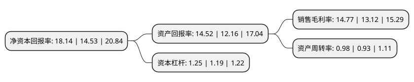

> 本页面由自动化程序生成于 2022年5月20日 01:34
> 内容可能存在错误，如有bug请提交issue至：https://github.com/Eroleice/doc-pi/issues
{.is-warning}

# 上市公司基本情况

## 基本资料

绝味食品股份有限公司（以下简称“绝味食品”）成立于2008年12月17日，长沙市。于2017年03月17日在上交所主板上市。

绝味食品注册资本61,471.3万元，主营业务:专注于休闲卤制食品的研发，生产和销售，致力于为消费者提供美味，新鲜，安全，优质的休闲美食。公司休闲卤制食品主要分为两类:一类是以鸭，鸡，猪等禽畜为原料的休闲卤制肉制品;另一类是以毛豆，萝卜，花生等为原料的休闲卤制素食品。以下是详细信息：

- 公司名称: 绝味食品股份有限公司
- 股票代码: 603517.SH
- 所在地: 湖南 - 长沙市
- 成立日期: 2008年12月17日
- 注册资本: 61,471.3万元
- 法定代表人: 戴文军
- 主营业务: 主营业务:专注于休闲卤制食品的研发，生产和销售，致力于为消费者提供美味，新鲜，安全，优质的休闲美食公司休闲卤制食品主要分为两类:一类是以鸭，鸡，猪等禽畜为原料的休闲卤制肉制品;另一类是以毛豆，萝卜，花生等为原料的休闲卤制素食品
- 公司官网: www.juewei.cn
- 公司介绍: 公司自成立以来，专注于休闲卤制食品的开发、生产和销售。以综合信息系统及供应链整合体系为支持，通过“以直营连锁为引导、加盟连锁为主体”的方式进行标准化的门店运营管理，打造国内现代化休闲卤制食品连锁企业领先品牌。公司是一家经营自主品牌的休闲卤制食品连锁企业，也是国内规模最大、拥有门店数量最多的休闲卤制食品连锁企业之一。公司已通过ISO9001国际质量管理体系认证、ISO22000食品安全管理体系认证，“绝味”商标被认定为中国驰名商标。

## 股东及高管情况

上市公司第一大股东为上海聚成企业发展合伙企业(有限合伙)，持股207,951,800股，占比33.83%，为上市公司实际控制人。

截至2022年03月31日，上市公司的前十大股东中，共有1名自然人股东，5名机构股东，3个产品账户，1个海外主体，其中5%以上大股东共有2名。上市公司前十大股东明细如下：

> 截至2022年03月31日，上市公司前十大股东信息如下：

| 股东名称 | 持股数量（股） | 持股比例 |
| --- | --- | --- |
| 上海聚成企业发展合伙企业(有限合伙) | 207,951,800 | 33.83% |
| 上海慧功企业发展合伙企业(有限合伙) | 49,243,900 | 8.01% |
| 香港中央结算有限公司(陆股通) | 25,306,590 | 4.12% |
| 上海成广企业发展合伙企业(有限合伙) | 16,884,280 | 2.75% |
| 上海福博企业发展合伙企业(有限合伙) | 15,397,960 | 2.5% |
| 中国工商银行股份有限公司-东方红启恒三年持有期混合型证券投资基金 | 9,664,969 | 1.57% |
| 招商银行股份有限公司-兴全合润混合型证券投资基金 | 6,640,357 | 1.08% |
| 招商银行股份有限公司-兴全合宜灵活配置混合型证券投资基金(LOF) | 6,142,773 | 1% |
| 林芝腾讯科技有限公司 | 6,086,000 | 0.99% |
| 唐颖 | 5,000,750 | 0.81% |

## 利润表分析

上市公司2021年总收入为65.48亿元，净利润为9.67亿元，实现盈利。

## 杜邦分析

> 数据列示周期：2021年 | 2020年 | 2019年
{.is-info}

上市公司的净资产收益率在近一年有所上升，上升幅度为24.85%，其变化情况分解如下：
- 上市公司的销售毛利率在近一年上升了12.58%，可能是生产效率的提升、商品原材料价格下跌或商品价格的上涨所致。
- 上市公司的资产周转率在近一年上升了5.38%，可能是源自于更快的销售回款或库存管理效果提升。
- 上市公司的财务杠杆比率在近一年上升了5.04%，可能是增加负债扩大生产规模。

