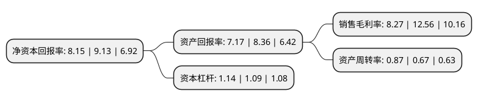

> 本页面由自动化程序生成于 2022年5月20日 01:35
> 内容可能存在错误，如有bug请提交issue至：https://github.com/Eroleice/doc-pi/issues
{.is-warning}

# 上市公司基本情况

## 基本资料

安记食品股份有限公司（以下简称“安记食品”）成立于1995年09月28日，泉州市。于2015年12月09日在上交所主板上市。

安记食品注册资本23,520万元，一直专注于调味品的研发，生产和销售，主要产品包括复合调味粉，天然提取物调味料，香辛料，酱类，风味清汤等五大类500多个品种。以下是详细信息：

- 公司名称: 安记食品股份有限公司
- 股票代码: 603696.SH
- 所在地: 福建 - 泉州市
- 成立日期: 1995年09月28日
- 注册资本: 23,520万元
- 法定代表人: 林肖芳
- 主营业务: 一直专注于调味品的研发，生产和销售，主要产品包括复合调味粉，天然提取物调味料，香辛料，酱类，风味清汤等五大类500多个品种
- 公司官网: www.anjifood.com
- 公司介绍: 公司自成立以来，一直专注于调味品的研发、生产和销售，主要产品包括复合调味粉、天然提取物调味料、香辛料、酱类、风味清汤等五大类500多个品种。公司作为行业领先企业，是《排骨粉调味料》行业标准(SB/T10526-2009)独家起草单位、《海鲜粉调味料》行业标准(SB/T10485-2008)第一起草单位、《牛肉粉调味料》行业标准(SB/T10513-2008)主要起草单位之一、《调味品分类》国家标准(GB/T20903-2007)主要起草单位之一。公司已获得ISO9001认证证书、HACCP认证证书、BRC认证证书。公司“安记牌排骨味王调味粉”、“安记牌安记香调味粉”、“安记牌五香粉”和“安记牌大骨浓汤调味粉”等产品先后荣获“2010年福建名牌产品”和“2013中国(国际)调味品及食品配料博览会金奖”等多项奖项和荣誉，在市场销售中处于领先地位。

## 股东及高管情况

上市公司第一大股东为林肖芳，持股116,880,434股，占比49.69%，为上市公司实际控制人。

截至2022年03月31日，上市公司的前十大股东中，共有7名自然人股东，1名机构股东，2个产品账户，其中5%以上大股东共有2名。上市公司前十大股东明细如下：

> 截至2022年03月31日，上市公司前十大股东信息如下：

| 股东名称 | 持股数量（股） | 持股比例 |
| --- | --- | --- |
| 林肖芳 | 116,880,434 | 49.69% |
| 东方联合国际投资(香港)有限公司 | 35,280,000 | 15% |
| 上海一村投资管理有限公司-一村启明星2号私募证券投资基金 | 4,661,899 | 1.98% |
| 中国农业银行股份有限公司-泰达宏利中证主要消费红利指数型证券投资基金 | 1,950,600 | 0.83% |
| 郑顺正 | 1,388,996 | 0.59% |
| 张长伍 | 856,331 | 0.36% |
| 庄红 | 830,000 | 0.35% |
| 李吉祥 | 805,000 | 0.34% |
| 郭博 | 734,200 | 0.31% |
| 陈珂 | 710,000 | 0.3% |

## 利润表分析

上市公司2021年总收入为5.48亿元，净利润为0.45亿元，实现盈利。

## 杜邦分析

> 数据列示周期：2021年 | 2020年 | 2019年
{.is-info}

上市公司的净资产收益率在近一年有所下降，下降幅度为-10.73%，其变化情况分解如下：
- 上市公司的销售毛利率在近一年下降了-34.16%，可能是生产效率的下降、商品原材料价格上涨或商品价格的下跌所致。
- 上市公司的资产周转率在近一年上升了29.85%，可能是源自于更快的销售回款或库存管理效果提升。
- 上市公司的财务杠杆比率在近一年上升了4.59%，可能是增加负债扩大生产规模。

