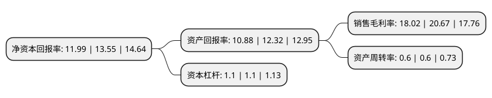

> 本页面由自动化程序生成于 2022年5月20日 01:35
> 内容可能存在错误，如有bug请提交issue至：https://github.com/Eroleice/doc-pi/issues
{.is-warning}

# 上市公司基本情况

## 基本资料

有友食品股份有限公司（以下简称“有友食品”）成立于2007年05月25日，重庆市。于2019年05月08日在上交所主板上市。

有友食品注册资本30,904.56万元，泡卤风味休闲食品的研发，生产和销售以下是详细信息：

- 公司名称: 有友食品股份有限公司
- 股票代码: 603697.SH
- 所在地: 重庆 - 重庆市
- 成立日期: 2007年05月25日
- 注册资本: 30,904.56万元
- 法定代表人: 鹿有忠
- 主营业务: 泡卤风味休闲食品的研发，生产和销售
- 公司官网: www.youyoufood.com
- 公司介绍: 公司是一家从事休闲食品研发、生产、销售，拥有国家发明专利的现代化、农业产业化食品企业。在休闲食品研发上大胆创新，开创泡肉之先河，为中国食品行业增加了一个新的产业。至今已拥有近5000余万元的固定资产，2万平方米的科研生产基地，已形成年产10000吨以上的生产能力。注册商标“有友”荣获中国驰名商标，首创的主导产品“有友泡凤爪”获得国家发明专利(专利号ZL99114725.1)。目前有友已开发出泡制品、卤制品和调味品等三大系列产品，计20多个品种30余个规格，产品覆盖全国除港、澳、台以外的所有省、自治区和直辖市。“有友泡凤爪”已成为行业第一品牌，占有泡凤爪全国30％以上、川渝60%以上的市场份额。

## 股东及高管情况

上市公司第一大股东为鹿有忠，持股151,933,520股，占比49.16%，为上市公司实际控制人。

截至2022年03月31日，上市公司的前十大股东中，共有8名自然人股东，2个产品账户，其中5%以上大股东共有3名。上市公司前十大股东明细如下：

> 截至2022年03月31日，上市公司前十大股东信息如下：

| 股东名称 | 持股数量（股） | 持股比例 |
| --- | --- | --- |
| 鹿有忠 | 151,933,520 | 49.16% |
| 赵英 | 39,572,667 | 12.8% |
| 鹿新 | 15,711,776 | 5.08% |
| 鹿有贵 | 3,856,308 | 1.25% |
| 鹿有明 | 3,567,807 | 1.15% |
| 高辰宇 | 3,091,000 | 1% |
| 贝婉莹 | 2,720,481 | 0.88% |
| 李广欣 | 1,380,000 | 0.45% |
| 中国建设银行股份有限公司-华夏新兴经济一年持有期混合型证券投资基金 | 1,294,998 | 0.42% |
| 中国建设银行股份有限公司企业年金计划-中国工商银行股份有限公司 | 1,203,500 | 0.39% |

## 利润表分析

上市公司2021年总收入为12.19亿元，净利润为2.19亿元，实现盈利。

## 杜邦分析

> 数据列示周期：2021年 | 2020年 | 2019年
{.is-info}

上市公司的净资产收益率在近一年有所下降，下降幅度为-11.51%，其变化情况分解如下：
- 上市公司的销售毛利率在近一年下降了-12.82%，可能是生产效率的下降、商品原材料价格上涨或商品价格的下跌所致。
- 上市公司的资产周转率在近一年下降了0%，可能是源自于更慢的销售回款或库存管理效果下降。
- 上市公司的财务杠杆比率在近一年下降了0%，可能是减少负债降低财务费用。

