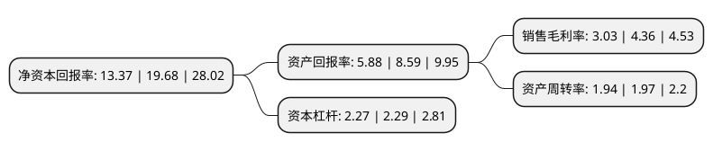

> 本页面由自动化程序生成于 2022年5月20日 01:35
> 内容可能存在错误，如有bug请提交issue至：https://github.com/Eroleice/doc-pi/issues
{.is-warning}

# 上市公司基本情况

## 基本资料

良品铺子股份有限公司（以下简称“良品铺子”）成立于2010年08月04日，武汉市。于2020年02月24日在上交所主板上市。

良品铺子注册资本40,100万元，主营业务:是一家通过数字化技术融合供应链管理及全渠道销售体系开展高品质休闲食品业务的品牌运营企业。主要产品:公司已形成覆盖肉类零食，坚果炒货，糖果糕点，果干果脯，素食山珍等多个品类。以下是详细信息：

- 公司名称: 良品铺子股份有限公司
- 股票代码: 603719.SH
- 所在地: 湖北 - 武汉市
- 成立日期: 2010年08月04日
- 注册资本: 40,100万元
- 法定代表人: 杨红春
- 主营业务: 主营业务:是一家通过数字化技术融合供应链管理及全渠道销售体系开展高品质休闲食品业务的品牌运营企业主要产品:公司已形成覆盖肉类零食，坚果炒货，糖果糕点，果干果脯，素食山珍等多个品类
- 公司官网: www.517lppz.com
- 公司介绍: 公司是一家通过数字化技术融合供应链管理及全渠道销售体系开展高品质休闲食品业务的品牌运营企业。报告期内，公司以消费者体验为中心，以大数据技术为基石，以全渠道销售服务为引擎，以现代化供应链管理和全链路食品安全控制为保障，把握消费者对休闲食品的需求与趋势，不断提高产品的品质标准和产业链的协同效应，建立了集市场研究、食品研发、采购质检、物流配送及全渠道销售的全产业链品牌运营模式。目前，公司已形成覆盖肉类零食、坚果炒货、糖果糕点、果干果脯、素食山珍等多个品类、1,000余种的产品组合，有效地满足了不同消费者群体在不同场景下的多元化休闲食品需求。经过多年的努力，公司获得了国家工商总局认定的“中国驰名商标”、商务部评定的“电子商务示范企业”、湖北省工商行政管理局评定的“湖北省著名商标企业”等荣誉称号。

## 股东及高管情况

上市公司第一大股东为宁波汉意投资管理合伙企业(有限合伙)，持股149,575,594股，占比37.3%，为上市公司实际控制人。

截至2022年03月31日，上市公司的前十大股东中，共有8名机构股东，1个产品账户，1个海外主体，其中5%以上大股东共有2名。上市公司前十大股东明细如下：

> 截至2022年03月31日，上市公司前十大股东信息如下：

| 股东名称 | 持股数量（股） | 持股比例 |
| --- | --- | --- |
| 宁波汉意投资管理合伙企业(有限合伙) | 149,575,594 | 37.3% |
| 达永有限公司 | 121,496,526 | 30.3% |
| HH LPPZ(HK)Holdings Limited | 18,000,144 | 4.49% |
| 宁波良品投资管理有限公司 | 11,970,120 | 2.99% |
| 珠海高瓴天达股权投资管理中心(有限合伙) | 7,796,521 | 1.94% |
| 宁波高瓴智远投资合伙企业(有限合伙) | 4,315,312 | 1.08% |
| 全国社保基金五零三组合 | 4,300,000 | 1.07% |
| 宁波汉宁倍好投资管理合伙企业(有限合伙) | 3,939,413 | 0.98% |
| 宁波汉亮奇好投资管理合伙企业(有限合伙) | 3,939,413 | 0.98% |
| 宁波汉林致好投资管理合伙企业(有限合伙) | 3,939,413 | 0.98% |

## 利润表分析

上市公司2021年总收入为93.23亿元，净利润为2.82亿元，实现盈利。

## 杜邦分析

> 数据列示周期：2021年 | 2020年 | 2019年
{.is-info}

上市公司的净资产收益率在近一年有所下降，下降幅度为-32.06%，其变化情况分解如下：
- 上市公司的销售毛利率在近一年下降了-30.5%，可能是生产效率的下降、商品原材料价格上涨或商品价格的下跌所致。
- 上市公司的资产周转率在近一年下降了-1.52%，可能是源自于更慢的销售回款或库存管理效果下降。
- 上市公司的财务杠杆比率在近一年下降了-0.87%，可能是减少负债降低财务费用。

