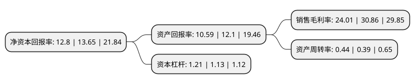

> 本页面由自动化程序生成于 2022年5月20日 01:35
> 内容可能存在错误，如有bug请提交issue至：https://github.com/Eroleice/doc-pi/issues
{.is-warning}

# 上市公司基本情况

## 基本资料

青岛日辰食品股份有限公司（以下简称“日辰股份”）成立于2001年03月23日，青岛市。于2019年08月28日在上交所主板上市。

日辰股份注册资本9,861.368万元，酱汁类调味料，粉体类调味料，食品添加剂的研发，生产和销售以下是详细信息：

- 公司名称: 青岛日辰食品股份有限公司
- 股票代码: 603755.SH
- 所在地: 山东 - 青岛市
- 成立日期: 2001年03月23日
- 注册资本: 9,861.368万元
- 法定代表人: 张华君
- 主营业务: 酱汁类调味料，粉体类调味料，食品添加剂的研发，生产和销售
- 公司官网: www.richen-qd.cn
- 公司介绍: 公司为国内最早的专业复合调味料生产商之一，主要生产酱汁类调味料、粉体类调味料以及少量食品添加剂，旨在为食品加工企业、连锁餐饮企业提供专业的调味解决方案，包括配方研发、精细化应用，以及标准化的生产。目前，公司年产量15,000吨以上，服务的食品加工企业类别包括肉食加工、水产加工、面食加工、蔬菜加工、鲜食加工等，服务的连锁餐饮企业类别包括中式餐饮、日式餐饮、韩式餐饮、西式餐饮等。同时，公司优选配方推出“味之物语”系列，代表性产品黑椒烧汁、烤肉酱、照烧汁等进入零售终端，面向终端消费者。公司为2015年度“食安山东”食品生产加工示范企业，2018年中国调味品品牌企业100强。2017年获得中国烹饪协会颁发的“中国餐饮30年优秀伙伴奖”。公司以领先的产品研发能力、严格的成本管理，国际标准的食品安全控制，致力于餐饮行业、食品加工行业调味的标准化与专业化的发展。

## 股东及高管情况

上市公司第一大股东为青岛博亚投资控股有限公司，持股55,465,261股，占比56.24%，为上市公司实际控制人。

截至2022年03月31日，上市公司的前十大股东中，共有4名机构股东，4个产品账户，2个海外主体，其中5%以上大股东共有2名。上市公司前十大股东明细如下：

> 截至2022年03月31日，上市公司前十大股东信息如下：

| 股东名称 | 持股数量（股） | 持股比例 |
| --- | --- | --- |
| 青岛博亚投资控股有限公司 | 55,465,261 | 56.24% |
| 青岛晨星股权投资管理合伙企业(有限合伙) | 8,948,396 | 9.07% |
| MAPLE MARBLE CORP. | 3,623,730 | 3.67% |
| 施罗德投资管理(香港)有限公司-施罗德环球基金系列中国A股(交易所) | 3,004,722 | 3.05% |
| 中国银行股份有限公司-华夏消费龙头混合型证券投资基金 | 1,253,224 | 1.27% |
| 福建德润壹号股权投资企业(有限合伙) | 1,248,047 | 1.27% |
| 福建融诚吾阳创业投资企业(有限合伙) | 1,248,047 | 1.27% |
| 中国农业银行股份有限公司-华夏消费升级灵活配置混合型证券投资基金 | 750,931 | 0.76% |
| UBS   AG | 724,207 | 0.73% |
| 施罗德投资管理有限公司-施罗德中国进取股票基金 | 605,800 | 0.61% |

## 利润表分析

上市公司2021年总收入为3.38亿元，净利润为0.81亿元，实现盈利。

## 杜邦分析

> 数据列示周期：2021年 | 2020年 | 2019年
{.is-info}

上市公司的净资产收益率在近一年有所下降，下降幅度为-6.23%，其变化情况分解如下：
- 上市公司的销售毛利率在近一年下降了-22.2%，可能是生产效率的下降、商品原材料价格上涨或商品价格的下跌所致。
- 上市公司的资产周转率在近一年上升了12.82%，可能是源自于更快的销售回款或库存管理效果提升。
- 上市公司的财务杠杆比率在近一年上升了7.08%，可能是增加负债扩大生产规模。

