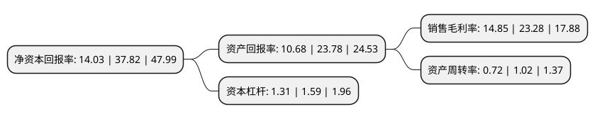

> 本页面由自动化程序生成于 2022年5月20日 01:36
> 内容可能存在错误，如有bug请提交issue至：https://github.com/Eroleice/doc-pi/issues
{.is-warning}

# 上市公司基本情况

## 基本资料

浙江华康药业股份有限公司（以下简称“华康股份”）成立于2001年07月10日，衢州市。于2021年02月09日在上交所主板上市。

华康股份注册资本16,318.4万元，主要从事木糖醇，山梨糖醇，麦芽糖醇，果葡糖浆等多种功能性糖醇，淀粉糖产品研发，生产，销售以下是详细信息：

- 公司名称: 浙江华康药业股份有限公司
- 股票代码: 605077.SH
- 所在地: 浙江 - 衢州市
- 成立日期: 2001年07月10日
- 注册资本: 16,318.4万元
- 法定代表人: 陈德水
- 主营业务: 主要从事木糖醇，山梨糖醇，麦芽糖醇，果葡糖浆等多种功能性糖醇，淀粉糖产品研发，生产，销售
- 公司官网: www.huakangpharma.com
- 公司介绍: 公司是一家主要从事木糖醇、山梨糖醇、麦芽糖醇、果葡糖浆等多种功能性糖醇、淀粉糖产品研发、生产、销售的高新技术企业，所属行业为食品、食品添加剂及淀粉糖制造。公司生产的木糖醇、山梨糖醇、麦芽糖醇、果葡糖浆等产品广泛应用于食品、饮料、日化等下游行业，具有较高的市场认可度。截至目前，发行人已与玛氏箭牌、亿滋、不凡帝、费列罗、好时、好丽友、可口可乐、百事可乐、康师傅、农夫山泉、娃哈哈、蒙牛等国内外知名食品饮料行业企业建立良好的长期合作关系，产品销往国内市场及欧洲、美洲、亚洲等全球主要国家和地区。经过多年持续研发投入，公司先后承担国家火炬计划、浙江省专利战略推进项目、衢州市指导性科技项目计划等多项国家、省、市级科研项目或重大课题，取得了丰富的研发成果，研发成果转化获得中国专利优秀奖、中国轻工业联合会科学技术进步奖一等奖、浙江省专利优秀奖等多项奖励。

## 股东及高管情况

上市公司第一大股东为陈德水，持股25,938,528股，占比15.9%，**疑似为**上市公司实际控制人。

截至2022年03月31日，上市公司的前十大股东中，共有6名自然人股东，4名机构股东，其中5%以上大股东共有5名。上市公司前十大股东明细如下：

> 未能通过持股比例判定出上市公司实际控制人（持股30%以上）
> 可能存在通过间接持股、联合持股、协议控制等方式拥有实际控制权的主体，具体请参考上市公司定期公告！
{.is-warning}

> 截至2022年03月31日，上市公司前十大股东信息如下：

| 股东名称 | 持股数量（股） | 持股比例 |
| --- | --- | --- |
| 陈德水 | 25,938,528 | 15.9% |
| 福建雅客食品有限公司 | 10,021,900 | 6.14% |
| 程新平 | 9,167,613 | 5.62% |
| 徐小荣 | 8,621,613 | 5.28% |
| 曹建宏 | 8,621,613 | 5.28% |
| 王远淞 | 8,157,186 | 4.99% |
| 余建明 | 7,221,613 | 4.43% |
| 杭州和盟和你投资管理有限公司-杭州和盟皓驰投资合伙企业(有限合伙) | 4,472,000 | 2.74% |
| 杭州唐春投资管理有限公司 | 4,461,160 | 2.73% |
| 开化同利投资管理合伙企业(有限合伙) | 3,593,800 | 2.2% |

## 利润表分析

上市公司2021年总收入为15.94亿元，净利润为2.36亿元，实现盈利。

## 杜邦分析

> 数据列示周期：2021年 | 2020年 | 2019年
{.is-info}

上市公司的净资产收益率在近一年有所下降，下降幅度为-62.9%，其变化情况分解如下：
- 上市公司的销售毛利率在近一年下降了-36.21%，可能是生产效率的下降、商品原材料价格上涨或商品价格的下跌所致。
- 上市公司的资产周转率在近一年下降了-29.41%，可能是源自于更慢的销售回款或库存管理效果下降。
- 上市公司的财务杠杆比率在近一年下降了-17.61%，可能是减少负债降低财务费用。

