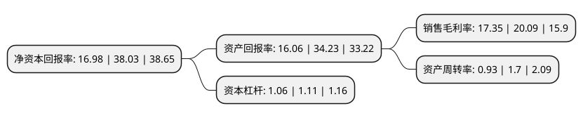

> 本页面由自动化程序生成于 2022年5月20日 01:36
> 内容可能存在错误，如有bug请提交issue至：https://github.com/Eroleice/doc-pi/issues
{.is-warning}

# 上市公司基本情况

## 基本资料

苏州市味知香食品股份有限公司（以下简称“味知香”）成立于2008年12月10日，苏州市。于2021年04月27日在上交所主板上市。

味知香注册资本10,000万元，公司主要从事半成品菜的研发，生产和销售。自成立以来，公司主营业务及主要产品未发生重大变化。以下是详细信息：

- 公司名称: 苏州市味知香食品股份有限公司
- 股票代码: 605089.SH
- 所在地: 江苏 - 苏州市
- 成立日期: 2008年12月10日
- 注册资本: 10,000万元
- 法定代表人: 夏靖
- 主营业务: 公司主要从事半成品菜的研发，生产和销售自成立以来，公司主营业务及主要产品未发生重大变化
- 公司官网: www.weizhixiang.com
- 公司介绍: 公司是行业领先的半成品菜生产企业之一，专注于半成品菜的研发、生产和销售，为消费者提供健康绿色、便捷美味的半成品菜肴。公司产品以良好的菜品口味、可靠的产品质量、便捷的用餐体验赢得了广大消费者的认可，建立了以“味知香”和“馔玉”两大品牌为核心的产品体系，公司产品包括肉禽类、水产类及其他类，涵盖数百种菜品，有效地满足了不同地区消费者的饮食习惯和口味偏好，作为食品企业，食品安全就是企业的命脉，质量与安全一定是重中之重：公司在行业内率先通过了ISO9001质量管理体系、ISO22000食品安全管理体系、ISO14001环境管理体系、OHSAS18001职业健康安全管理体系等4大体系的认证。公司在全国各大城市均设有门店1100余家，产品由PICC中国人保财险承保，公司拥有多项专利和数百个注册商标。

## 股东及高管情况

上市公司第一大股东为夏靖，持股54,750,000股，占比54.75%，为上市公司实际控制人。

截至2022年03月31日，上市公司的前十大股东中，共有4名自然人股东，2名机构股东，4个产品账户，其中5%以上大股东共有3名。上市公司前十大股东明细如下：

> 截至2022年03月31日，上市公司前十大股东信息如下：

| 股东名称 | 持股数量（股） | 持股比例 |
| --- | --- | --- |
| 夏靖 | 54,750,000 | 54.75% |
| 苏州市金花生管理咨询企业(有限合伙) | 7,500,000 | 7.5% |
| 夏九林 | 7,500,000 | 7.5% |
| 章松柏 | 3,750,000 | 3.75% |
| 陈洪 | 1,500,000 | 1.5% |
| 中国建设银行股份有限公司-中欧新蓝筹灵活配置混合型证券投资基金 | 934,658 | 0.93% |
| 兴业银行股份有限公司-中欧新趋势股票型证券投资基金(LOF) | 617,526 | 0.62% |
| 中国工商银行股份有限公司-中欧精选灵活配置定期开放混合型发起式证券投资基金 | 481,351 | 0.48% |
| 上海浦东发展银行股份有限公司-长信金利趋势混合型证券投资基金 | 399,908 | 0.4% |
| 中信证券股份有限公司客户信用交易担保证券账户 | 319,690 | 0.32% |

## 利润表分析

上市公司2021年总收入为7.64亿元，净利润为1.32亿元，实现盈利。

## 杜邦分析

> 数据列示周期：2021年 | 2020年 | 2019年
{.is-info}

上市公司的净资产收益率在近一年有所下降，下降幅度为-55.35%，其变化情况分解如下：
- 上市公司的销售毛利率在近一年下降了-13.64%，可能是生产效率的下降、商品原材料价格上涨或商品价格的下跌所致。
- 上市公司的资产周转率在近一年下降了-45.29%，可能是源自于更慢的销售回款或库存管理效果下降。
- 上市公司的财务杠杆比率在近一年下降了-4.5%，可能是减少负债降低财务费用。

