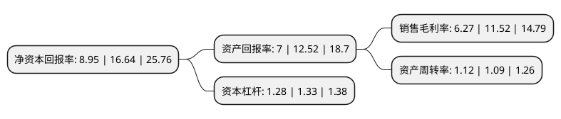

> 本页面由自动化程序生成于 2022年5月20日 01:37
> 内容可能存在错误，如有bug请提交issue至：https://github.com/Eroleice/doc-pi/issues
{.is-warning}

# 上市公司基本情况

## 基本资料

佳禾食品工业股份有限公司（以下简称“佳禾食品”）成立于2001年05月15日，苏州市。于2021年04月30日在上交所主板上市。

佳禾食品注册资本40,001万元，公司主要从事植脂末，咖啡及其他固体饮料等产品的研发，生产和销售业务。以下是详细信息：

- 公司名称: 佳禾食品工业股份有限公司
- 股票代码: 605300.SH
- 所在地: 江苏 - 苏州市
- 成立日期: 2001年05月15日
- 注册资本: 40,001万元
- 法定代表人: 柳新荣
- 主营业务: 公司主要从事植脂末，咖啡及其他固体饮料等产品的研发，生产和销售业务
- 公司官网: www.cograin.cn
- 公司介绍: 公司自成立以来始终秉持立足自主研发、保障产品品质的理念，为客户提供安全、健康、优质、美味的产品，并以优良的产品品质、先进的研发技术、个性化的定制服务奠定了良好的市场地位。公司是国内较早进入植脂末产品领域的企业，自成立以来始终深耕于以植脂末为核心的食品原料及配料的研发、生产和销售。凭借突出的研发能力、稳定的产品质量、完善的制造体系以及广泛的营销服务网络，公司植脂末的产品品质、品牌形象和知名度不断提升，公司植脂末已成为国内外奶茶、咖啡等领域具有较高知名度的原料产品，下游客户不仅包含香飘飘、统一、娃哈哈、联合利华、TORABIKA(印尼)等知名食品工业企业，也不乏“CoCo都可”、“85°C”、“沪上阿姨”、“古茗”等消费者耳熟能详的食品饮料连锁店；公司的“晶花”商标及品牌分别被江苏省工商局、江苏省商务厅评为“江苏省著名商标”、“江苏省重点培育和发展的国际知名品牌”。近年来，公司通过引进德国先进咖啡生产设备、构建工业计算机自动化控制系统，已形成规模化的咖啡生产能力，公司的速溶咖啡生产车间被认定为“江苏省示范智能车间”，并打造出一支咖啡研发和制造领域的专业人才队伍，持续保障咖啡生产工艺和品质。

## 股东及高管情况

上市公司第一大股东为柳新荣，持股129,025,651股，占比32.26%，为上市公司实际控制人。

截至2022年03月31日，上市公司的前十大股东中，共有3名自然人股东，4名机构股东，3个产品账户，其中5%以上大股东共有4名。上市公司前十大股东明细如下：

> 截至2022年03月31日，上市公司前十大股东信息如下：

| 股东名称 | 持股数量（股） | 持股比例 |
| --- | --- | --- |
| 柳新荣 | 129,025,651 | 32.26% |
| 唐正青 | 92,161,180 | 23.04% |
| 西藏五色水创业投资管理有限公司 | 88,434,182 | 22.11% |
| 宁波和理投资咨询合伙企业(有限合伙) | 20,832,113 | 5.21% |
| 国际金融公司 | 17,565,921 | 4.39% |
| 柳新仁 | 11,980,953 | 3% |
| 中国建设银行股份有限公司-华夏新兴经济一年持有期混合型证券投资基金 | 946,200 | 0.24% |
| 国华人寿保险股份有限公司-分红五号 | 664,400 | 0.17% |
| 中国建设银行股份有限公司-华夏新兴消费混合型证券投资基金 | 638,100 | 0.16% |
| 中国工商银行股份有限公司-华夏优加生活混合型证券投资基金 | 596,000 | 0.15% |

## 利润表分析

上市公司2021年总收入为23.99亿元，净利润为1.5亿元，实现盈利。

## 杜邦分析

> 数据列示周期：2021年 | 2020年 | 2019年
{.is-info}

上市公司的净资产收益率在近一年有所下降，下降幅度为-46.21%，其变化情况分解如下：
- 上市公司的销售毛利率在近一年下降了-45.57%，可能是生产效率的下降、商品原材料价格上涨或商品价格的下跌所致。
- 上市公司的资产周转率在近一年上升了2.75%，可能是源自于更快的销售回款或库存管理效果提升。
- 上市公司的财务杠杆比率在近一年下降了-3.76%，可能是减少负债降低财务费用。

