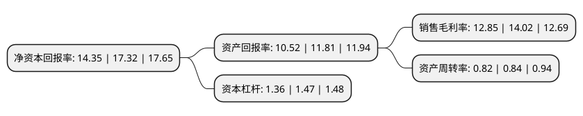

> 本页面由自动化程序生成于 2022年5月20日 01:37
> 内容可能存在错误，如有bug请提交issue至：https://github.com/Eroleice/doc-pi/issues
{.is-warning}

# 上市公司基本情况

## 基本资料

南侨食品集团(上海)股份有限公司（以下简称“南侨食品”）成立于2010年08月02日，上海市。于2021年05月18日在上交所主板上市。

南侨食品注册资本42,765.441万元，主要从事烘焙油脂相关制品的研发，生产与销售。以下是详细信息：

- 公司名称: 南侨食品集团(上海)股份有限公司
- 股票代码: 605339.SH
- 所在地: 上海 - 上海市
- 成立日期: 2010年08月02日
- 注册资本: 42,765.441万元
- 法定代表人: 陈正文
- 主营业务: 主要从事烘焙油脂相关制品的研发，生产与销售
- 公司官网: www.ncbakery.com
- 公司介绍: 公司成立于2010年8月2日，主要从事烘焙油脂相关制品的研发,生产与销售.公司经营油脂逾20年，始终秉持追求设备第一、技术第一、品质第一、服务第一的目标和使命服务广大食品消费市场。公司专业生产烘焙油脂相关产品，产品按照应用领域来分主要有烘焙应用油脂、淡奶油、馅料、冷冻面团、进口品五大系列，产品范围涵盖200多个品种。公司拥有丰富的生产和营销管理经验，旗下知名品牌荟萃，产品多样化，适合不同类型客户的工艺及市场需求。公司拥有天津、广州、上海三地生产工厂，以先进的研发技术、高端的品质管理、全方位的售后服务，在烘焙油脂领域成功塑造金字招牌，客户遍及中国各主要城市。经过多年努力，公司已发展成为国内烘焙油脂市场领导者品牌之一。

## 股东及高管情况

上市公司第一大股东为南侨食品集团(上海)股份有限公司未确认持有人证券专用账户，持股359,121,799股，占比83.97%，为上市公司实际控制人。

截至2022年03月31日，上市公司的前十大股东中，共有4名自然人股东，2名机构股东，4个产品账户，其中5%以上大股东共有1名。上市公司前十大股东明细如下：

> 截至2022年03月31日，上市公司前十大股东信息如下：

| 股东名称 | 持股数量（股） | 持股比例 |
| --- | --- | --- |
| 南侨食品集团(上海)股份有限公司未确认持有人证券专用账户 | 359,121,799 | 83.97% |
| 梁盛谊 | 8,068,788 | 1.89% |
| 中国银行股份有限公司-富国美丽中国混合型证券投资基金 | 1,107,710 | 0.26% |
| 江润林 | 998,900 | 0.23% |
| 方国伟 | 997,700 | 0.23% |
| 招商银行股份有限公司-富国天合稳健优选混合型证券投资基金 | 783,400 | 0.18% |
| 翁俊 | 645,666 | 0.15% |
| 天风证券-光大银行-天风证券天旭1号集合资产管理计划 | 527,800 | 0.12% |
| 北京嘉华宝通咨询有限公司 | 479,000 | 0.11% |
| 宁波梅山保税港区侨祥投资管理合伙企业(有限合伙) | 460,078 | 0.11% |

## 利润表分析

上市公司2021年总收入为28.72亿元，净利润为3.69亿元，实现盈利。

## 杜邦分析

> 数据列示周期：2021年 | 2020年 | 2019年
{.is-info}

上市公司的净资产收益率在近一年有所下降，下降幅度为-17.15%，其变化情况分解如下：
- 上市公司的销售毛利率在近一年下降了-8.35%，可能是生产效率的下降、商品原材料价格上涨或商品价格的下跌所致。
- 上市公司的资产周转率在近一年下降了-2.38%，可能是源自于更慢的销售回款或库存管理效果下降。
- 上市公司的财务杠杆比率在近一年下降了-7.48%，可能是减少负债降低财务费用。

