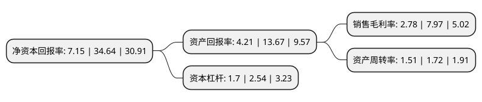

> 本页面由自动化程序生成于 2022年5月20日 01:37
> 内容可能存在错误，如有bug请提交issue至：https://github.com/Eroleice/doc-pi/issues
{.is-warning}

# 上市公司基本情况

## 基本资料

春雪食品集团股份有限公司（以下简称“春雪食品”）成立于2012年11月16日，烟台市。于2021年10月13日在上交所主板上市。

春雪食品注册资本20,000万元，专业从事白羽鸡鸡肉食品的研发，生产加工和销售业务以下是详细信息：

- 公司名称: 春雪食品集团股份有限公司
- 股票代码: 605567.SH
- 所在地: 山东 - 烟台市
- 成立日期: 2012年11月16日
- 注册资本: 20,000万元
- 法定代表人: 郑维新
- 主营业务: 专业从事白羽鸡鸡肉食品的研发，生产加工和销售业务
- 公司官网: www.springsnowfood.com
- 公司介绍: 公司专业从事白羽鸡鸡肉食品的研发、生产加工和销售业务，致力于成为中国鸡肉调理品细分行业的龙头企业。公司主要产品为鸡肉调理品和生鲜品。公司核心经营管理团队是国内最早进入鸡肉深加工调理品领域的团队之一，公司在鸡肉调理品领域具有较高的知名度和市场占有率。公司已通过ISO9001、ISO22000、ISO45001、ISO14001、HACCP、欧盟GAP、欧盟BRC、绿色食品等系列认证，获得CNAS国家实验室能力认可，并被认定为全国首批24家出口食品“三同”示范企业之一。公司产品出口日本、欧盟多年，拥有伊藤忠商事、德克士快餐、家家悦超市、全家便利店、嘉吉动物蛋白等一批粘性较高的国内外知名客户。

## 股东及高管情况

上市公司第一大股东为山东春雪食品有限公司，持股54,045,000股，占比27.02%，**疑似为**上市公司实际控制人。

截至2022年03月31日，上市公司的前十大股东中，共有1名自然人股东，7名机构股东，2个产品账户，其中5%以上大股东共有3名。上市公司前十大股东明细如下：

> 未能通过持股比例判定出上市公司实际控制人（持股30%以上）
> 可能存在通过间接持股、联合持股、协议控制等方式拥有实际控制权的主体，具体请参考上市公司定期公告！
{.is-warning}

> 截至2022年03月31日，上市公司前十大股东信息如下：

| 股东名称 | 持股数量（股） | 持股比例 |
| --- | --- | --- |
| 山东春雪食品有限公司 | 54,045,000 | 27.02% |
| 潍坊市同利投资中心(有限合伙) | 23,226,450 | 11.61% |
| 郑维新 | 14,623,950 | 7.31% |
| 上海天自投资管理有限公司-烟台天自雪瑞股权投资中心(有限合伙) | 9,960,000 | 4.98% |
| 潍坊市春华投资中心(有限合伙) | 9,004,500 | 4.5% |
| 潍坊市华元投资中心(有限合伙) | 7,743,000 | 3.87% |
| 山东毅达创业投资基金合伙企业(有限合伙) | 7,500,000 | 3.75% |
| 上海天自投资管理有限公司-烟台天自春雪股权投资中心(有限合伙) | 6,495,000 | 3.25% |
| 山东豪迈欣兴股权投资基金合伙企业(有限合伙) | 4,500,000 | 2.25% |
| 潍坊市同盈投资管理中心(有限合伙) | 2,738,550 | 1.37% |

## 利润表分析

上市公司2021年总收入为20.33亿元，净利润为0.56亿元，实现盈利。

## 杜邦分析

> 数据列示周期：2021年 | 2020年 | 2019年
{.is-info}

上市公司的净资产收益率在近一年有所下降，下降幅度为-79.36%，其变化情况分解如下：
- 上市公司的销售毛利率在近一年下降了-65.12%，可能是生产效率的下降、商品原材料价格上涨或商品价格的下跌所致。
- 上市公司的资产周转率在近一年下降了-12.21%，可能是源自于更慢的销售回款或库存管理效果下降。
- 上市公司的财务杠杆比率在近一年下降了-33.07%，可能是减少负债降低财务费用。

