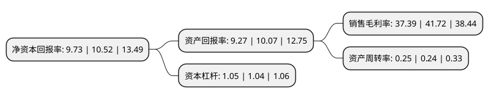

> 本页面由自动化程序生成于 2022年5月20日 01:37
> 内容可能存在错误，如有bug请提交issue至：https://github.com/Eroleice/doc-pi/issues
{.is-warning}

# 上市公司基本情况

## 基本资料

嘉必优生物技术(武汉)股份有限公司（以下简称“嘉必优”）成立于2004年09月22日，武汉市。于2019年12月19日在上交所科创板上市。

嘉必优注册资本12,000万元，公司的主营业务包括多不饱和脂肪酸ARA，藻油DHA及SA，天然β-胡萝卜素等多个系列产品的研发，生产与销售。公司的主要产品包括ARA，DHA等系列产品。以下是详细信息：

- 公司名称: 嘉必优生物技术(武汉)股份有限公司
- 股票代码: 688089.SH
- 所在地: 湖北 - 武汉市
- 成立日期: 2004年09月22日
- 注册资本: 12,000万元
- 法定代表人: 易德伟
- 主营业务: 公司的主营业务包括多不饱和脂肪酸ARA，藻油DHA及SA，天然β-胡萝卜素等多个系列产品的研发，生产与销售公司的主要产品包括ARA，DHA等系列产品
- 公司官网: www.cabio.cn
- 公司介绍: 公司以生物技术为立足之本，集成工业菌种定向优化技术、发酵精细调控技术、高效分离纯化制备技术，通过可持续的微生物合成制造方式，为全球营养与健康领域的客户提供高品质的营养素产品与创新的解决方案。公司的主营业务包括多不饱和脂肪酸ARA、藻油DHA及SA、天然β-胡萝卜素等多个系列产品的研发、生产与销售，产品广泛应用于婴幼儿配方食品、膳食营养补充剂和健康食品、特殊医学用途配方食品等领域。公司是国内最早从事以微生物合成法生产多不饱和脂肪酸及脂溶性营养素的高新技术企业之一，建立了系统完整的技术平台，拥有多项具有自主知识产权的产品和技术，2016年获得了国务院颁发的“国家科学技术进步二等奖”。公司主导及参与了《食品安全国家标准食品添加剂花生四烯酸油脂(发酵法)》(GB26401-2011)、《食品安全国家标准食品添加剂二十二碳六烯酸油脂(发酵法)》(GB26400-2011)等国家标准的制订；承担了“花生四烯酸发酵生产关键技术创新及工艺集成”、“二十二碳六烯酸发酵生产的关键技术创新及产业化”等国家“863”计划项目。

## 股东及高管情况

上市公司第一大股东为武汉烯王生物工程有限公司，持股53,100,000股，占比44.25%，为上市公司实际控制人。

截至2022年05月06日，上市公司的前十大股东中，共有2名自然人股东，5名机构股东，3个产品账户，其中5%以上大股东共有4名。上市公司前十大股东明细如下：

> 截至2022年05月06日，上市公司前十大股东信息如下：

| 股东名称 | 持股数量（股） | 持股比例 |
| --- | --- | --- |
| 武汉烯王生物工程有限公司 | 53,100,000 | 44.25% |
| 武汉烯王生物工程有限公司 | 53,100,000 | 44.25% |
| 贝优有限公司 | 12,751,000 | 10.6258% |
| 贝优有限公司 | 12,751,000 | 10.63% |
| 招商银行股份有限公司-鹏华新兴产业混合型证券投资基金 | 4,083,222 | 3.4% |
| 易德伟 | 1,665,269 | 1.39% |
| 工银资管(全球)有限公司-客户资金(交易所) | 1,375,978 | 1.15% |
| 交通银行股份有限公司-鹏华信用增利债券型证券投资基金 | 1,281,294 | 1.07% |
| 鹏华基金管理有限公司-社保基金17031组合 | 1,079,144 | 0.9% |
| 王华标 | 1,026,732 | 0.86% |

## 利润表分析

上市公司2021年总收入为3.51亿元，净利润为1.31亿元，实现盈利。

## 杜邦分析

> 数据列示周期：2021年 | 2020年 | 2019年
{.is-info}

上市公司的净资产收益率在近一年有所下降，下降幅度为-7.51%，其变化情况分解如下：
- 上市公司的销售毛利率在近一年下降了-10.38%，可能是生产效率的下降、商品原材料价格上涨或商品价格的下跌所致。
- 上市公司的资产周转率在近一年上升了4.17%，可能是源自于更快的销售回款或库存管理效果提升。
- 上市公司的财务杠杆比率在近一年上升了0.96%，可能是增加负债扩大生产规模。

