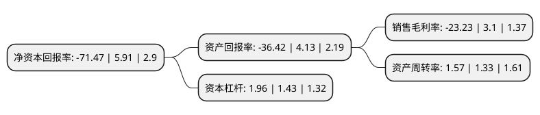

> 本页面由自动化程序生成于 2022年5月20日 01:03
> 内容可能存在错误，如有bug请提交issue至：https://github.com/Eroleice/doc-pi/issues
{.is-warning}

# 上市公司基本情况

## 基本资料

湖南正虹科技发展股份有限公司（以下简称“正虹科技”）成立于1997年03月12日，岳阳市。于1997年03月18日在深交所主板上市。

正虹科技注册资本26,663.458万元，主要产品:饲料，肉食品。以下是详细信息：

- 公司名称: 湖南正虹科技发展股份有限公司
- 股票代码: 000702.SZ
- 所在地: 湖南 - 岳阳市
- 成立日期: 1997年03月12日
- 注册资本: 26,663.458万元
- 法定代表人: 刘献文
- 主营业务: 主要产品:饲料，肉食品
- 公司官网: www.chinazhjt.com.cn
- 公司介绍: 公司是一家以研发生产销售饲料产品为主营业务，拥有自主知识产权的大型企业集团。公司除进行饲料加工外，还从事良种猪繁育、肉食品加工、生物兽药以及进出口贸易等业务。公司是中国饲料行业中最早改制上市的股份制企业，是农业部等八部委联合评定的第一批“农业产业化国家重点龙头企业”和农业部评定的第一批全国农产品加工业示范企业。“正虹”商标是中国饲料行业第一个“驰名商标”。“正虹牌”饲料是“中国名牌产品”、“国家免检产品”、“饲料行业信得过产品”。公司主打产品——“QF-001”猪高蛋白浓缩料，公司先后荣获全国饲料行业唯一银质奖章后，后又荣获几十余项省部级以上重大荣誉与奖励；公司被科技部批准成立“国家猪高蛋白浓缩料技术推广研究中心”。公司的“猪优质高效饲料产业化关键技术研究与推广”项目获国务院颁发的国家科学技术进步奖；公司科研创新项目“猪健康养殖的营养调控技术研究与示范推广”等荣获国务院颁发的国家科学技术进步奖；2012年，正虹原种猪场荣膺“国家生猪核心育种场”。

## 股东及高管情况

上市公司第一大股东为岳阳市屈原农垦有限责任公司，持股67,017,616股，占比25.13%，**疑似为**上市公司实际控制人。

截至2022年03月31日，上市公司的前十大股东中，共有7名自然人股东，1名机构股东，1个产品账户，1个海外主体，其中5%以上大股东共有1名。上市公司前十大股东明细如下：

> 未能通过持股比例判定出上市公司实际控制人（持股30%以上）
> 可能存在通过间接持股、联合持股、协议控制等方式拥有实际控制权的主体，具体请参考上市公司定期公告！
{.is-warning}

> 截至2022年03月31日，上市公司前十大股东信息如下：

| 股东名称 | 持股数量（股） | 持股比例 |
| --- | --- | --- |
| 岳阳市屈原农垦有限责任公司 | 67,017,616 | 25.13% |
| 芜湖长元股权投资基金(有限合伙) | 9,605,611 | 3.6% |
| 周宇光 | 8,935,450 | 3.35% |
| 胡玉兰 | 5,762,300 | 2.16% |
| MERRILL LYNCH INTERNATIONAL | 2,674,167 | 1% |
| 徐琳 | 1,678,975 | 0.63% |
| 陈建建 | 1,460,002 | 0.55% |
| 方志尧 | 1,360,000 | 0.51% |
| 段寻 | 1,218,200 | 0.46% |
| 张浩 | 1,054,800 | 0.4% |

## 利润表分析

上市公司2021年总收入为14.31亿元，净利润为-3.33亿元，**未实现盈利**。

## 杜邦分析

> 数据列示周期：2021年 | 2020年 | 2019年
{.is-info}

上市公司的净资产收益率在近一年有所下降，下降幅度为-1309.31%，其变化情况分解如下：
- 上市公司的销售毛利率在近一年下降了-849.35%，可能是生产效率的下降、商品原材料价格上涨或商品价格的下跌所致。
- 上市公司的资产周转率在近一年上升了18.05%，可能是源自于更快的销售回款或库存管理效果提升。
- 上市公司的财务杠杆比率在近一年上升了37.06%，可能是增加负债扩大生产规模。

