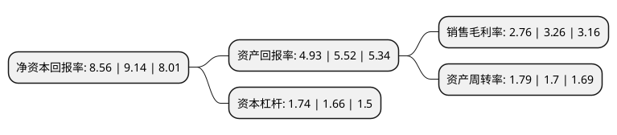

> 本页面由自动化程序生成于 2022年5月20日 01:05
> 内容可能存在错误，如有bug请提交issue至：https://github.com/Eroleice/doc-pi/issues
{.is-warning}

# 上市公司基本情况

## 基本资料

广东粤海饲料集团股份有限公司（以下简称“粤海饲料”）成立于1994年01月13日，湛江市。于2022年02月16日在深交所主板上市。

粤海饲料注册资本70,000万元，公司主要从事水产饲料研发，生产及销售，并以虾料，海水鱼料等特种水产饲料为主。主要产品包括以虾料，海水鱼料，黄颡鱼料，乌鳢料，加州鲈鱼料，石斑鱼料等为代表的特种水产配合饲料，以及以膨化草鱼料，膨化罗非鱼料等为代表的普通水产配合饲料。以下是详细信息：

- 公司名称: 广东粤海饲料集团股份有限公司
- 股票代码: 001313.SZ
- 所在地: 广东 - 湛江市
- 成立日期: 1994年01月13日
- 注册资本: 70,000万元
- 法定代表人: 郑石轩
- 主营业务: 公司主要从事水产饲料研发，生产及销售，并以虾料，海水鱼料等特种水产饲料为主主要产品包括以虾料，海水鱼料，黄颡鱼料，乌鳢料，加州鲈鱼料，石斑鱼料等为代表的特种水产配合饲料，以及以膨化草鱼料，膨化罗非鱼料等为代表的普通水产配合饲料
- 公司官网: www.yuehaifeed.com
- 公司介绍: 公司是一家集研发、生产、销售于一体，以水产动物饲料、添加剂预混料、水产动保等为主营业务的国家重点高新技术企业，是我国大型的集团化优质水产饲料生产基地。集团下属子公司分布于广东、广西、浙江、福建、江苏、湖南、湖北、山东、海南等中国内陆、沿海地区。公司将适时在越南、印度和东南亚等国外特种水产养殖的发达地区建立生产基地，逐步完善集团在全国的生产基地布局并向海外拓展，扩大公司的销售区域和品牌影响力。公司建立了完善的市场营销网络系统，不断强化服务能力建设，与客户建立了紧密的合作关系，旗下的粤海牌、粤佳牌、海佳牌、海荣牌系列水产饲料可满足不同客户、不同养殖品种的需求。公司生产的“粤海牌”草虾配合饲料、对虾配合饲料、南美白对虾配合饲料，“粤佳牌”海水鱼配合饲料、草虾配合饲料、南美白对虾配合饲料、罗非鱼配合饲料，“海佳牌”对虾配合饲料、生鱼配合饲料，“海荣牌”草虾配合饲料、罗非鱼配合饲料先后被评为广东省名牌产品，“粤海牌”水产配合饲料被评为福建省名牌产品。

## 股东及高管情况

上市公司第一大股东为湛江市对虾饲料有限公司，持股264,612,000股，占比37.8%，为上市公司实际控制人。

截至2022年03月31日，上市公司的前十大股东中，共有4名自然人股东，4名机构股东，1个产品账户，1个海外主体，其中5%以上大股东共有4名。上市公司前十大股东明细如下：

> 截至2022年03月31日，上市公司前十大股东信息如下：

| 股东名称 | 持股数量（股） | 持股比例 |
| --- | --- | --- |
| 湛江市对虾饲料有限公司 | 264,612,000 | 37.8% |
| 香港煌達實業有限公司 | 164,106,000 | 23.44% |
| Fortune Magic Investment Limited | 99,714,000 | 14.24% |
| 湛江承泽投资中心(有限合伙) | 52,392,000 | 7.48% |
| 东莞中科中广创业投资有限公司 | 9,588,000 | 1.37% |
| 广东中科白云新兴产业创业投资基金有限公司 | 9,588,000 | 1.37% |
| 陈叶菲 | 982,500 | 0.14% |
| 王光坤 | 945,600 | 0.14% |
| 沈海军 | 619,298 | 0.09% |
| 周振 | 575,999 | 0.08% |

## 利润表分析

上市公司2021年总收入为67.25亿元，净利润为1.85亿元，实现盈利。

## 杜邦分析

> 数据列示周期：2021年 | 2020年 | 2019年
{.is-info}

上市公司的净资产收益率在近一年有所下降，下降幅度为-6.35%，其变化情况分解如下：
- 上市公司的销售毛利率在近一年下降了-15.34%，可能是生产效率的下降、商品原材料价格上涨或商品价格的下跌所致。
- 上市公司的资产周转率在近一年上升了5.29%，可能是源自于更快的销售回款或库存管理效果提升。
- 上市公司的财务杠杆比率在近一年上升了4.82%，可能是增加负债扩大生产规模。

