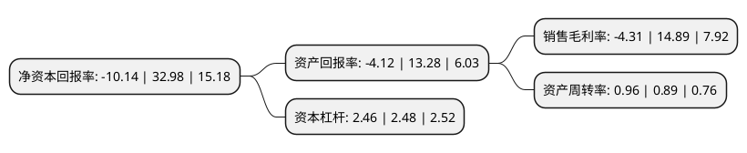

> 本页面由自动化程序生成于 2022年5月20日 01:06
> 内容可能存在错误，如有bug请提交issue至：https://github.com/Eroleice/doc-pi/issues
{.is-warning}

# 上市公司基本情况

## 基本资料

天康生物股份有限公司（以下简称“天康生物”）成立于2000年12月28日，乌鲁木齐市。于2006年12月26日在深交所中小板上市。

天康生物注册资本135,385.659万元，主营业务:饲料及以兽用生物制品为主的兽药的生产与销售以下是详细信息：

- 公司名称: 天康生物股份有限公司
- 股票代码: 002100.SZ
- 所在地: 新疆 - 乌鲁木齐市
- 成立日期: 2000年12月28日
- 注册资本: 135,385.659万元
- 法定代表人: 杨焰
- 主营业务: 主营业务:饲料及以兽用生物制品为主的兽药的生产与销售
- 公司官网: www.tcsw.com.cn
- 公司介绍: 公司是一家集兽用生物制品与动物疫病防治、现代生猪科学育种与养殖、饲料研发与生产、生猪屠宰加工配售为一体的农牧类上市公司公司是首批农业产业化国家重点龙头企业。公司始终坚持围绕现代农牧，在饲料、兽用生物制品、生猪养殖、放心肉食品等关键环节精耕细作，成功搭建起集饲料、生物制药、养殖、食品、蛋白油脂、融资担保为主的农牧产业链基础。公司将坚定地依据自身的专业能力和核心竞争力，紧紧围绕畜牧养殖的关键环节，包括：饲料、饲养、动保、良种繁育(主要指生猪)以及养殖服务体系和金融服务体系建设，为养殖户提供全面解决方案，提升养殖效率，实现公司与客户的共赢发展，努力把公司打造成为国内一流的“健康养殖服务商，安全食品供应商”。

## 股东及高管情况

上市公司第一大股东为新疆生产建设兵团国有资产经营有限责任公司，持股283,929,184股，占比20.97%，**疑似为**上市公司实际控制人。

截至2022年03月31日，上市公司的前十大股东中，共有1名自然人股东，3名机构股东，3个产品账户，1个海外主体，2名其他股东，其中5%以上大股东共有2名。上市公司前十大股东明细如下：

> 未能通过持股比例判定出上市公司实际控制人（持股30%以上）
> 可能存在通过间接持股、联合持股、协议控制等方式拥有实际控制权的主体，具体请参考上市公司定期公告！
{.is-warning}

> 截至2022年03月31日，上市公司前十大股东信息如下：

| 股东名称 | 持股数量（股） | 持股比例 |
| --- | --- | --- |
| 新疆生产建设兵团国有资产经营有限责任公司 | 283,929,184 | 20.97% |
| 北京融元宝通资产管理合伙企业(有限合伙) | 68,754,835 | 5.08% |
| 中国银河证券股份有限公司 | 39,127,516 | 2.89% |
| 新疆畜牧科学院 | 28,499,744 | 2.1% |
| 新疆维吾尔自治区畜牧科学院 | 28,499,744 | 2.1% |
| 全国社保基金一零六组合 | 22,818,792 | 1.69% |
| 全国社保基金一一五组合 | 22,738,257 | 1.68% |
| 王佐宇 | 21,700,000 | 1.6% |
| 中国工商银行股份有限公司-财通价值动量混合型证券投资基金 | 17,333,353 | 1.28% |
| 香港中央结算有限公司(陆股通) | 16,152,980 | 1.19% |

## 利润表分析

上市公司2021年总收入为157.44亿元，净利润为-6.79亿元，**未实现盈利**。

## 杜邦分析

> 数据列示周期：2021年 | 2020年 | 2019年
{.is-info}

上市公司的净资产收益率在近一年有所下降，下降幅度为-130.75%，其变化情况分解如下：
- 上市公司的销售毛利率在近一年下降了-128.95%，可能是生产效率的下降、商品原材料价格上涨或商品价格的下跌所致。
- 上市公司的资产周转率在近一年上升了7.87%，可能是源自于更快的销售回款或库存管理效果提升。
- 上市公司的财务杠杆比率在近一年下降了-0.81%，可能是减少负债降低财务费用。

