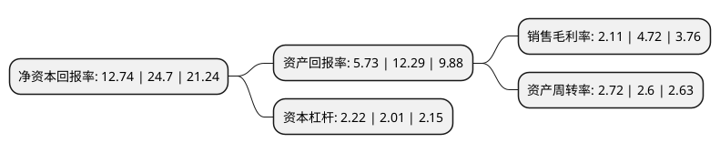

> 本页面由自动化程序生成于 2022年5月20日 01:08
> 内容可能存在错误，如有bug请提交issue至：https://github.com/Eroleice/doc-pi/issues
{.is-warning}

# 上市公司基本情况

## 基本资料

广东海大集团股份有限公司（以下简称“海大集团”）成立于2004年01月08日，广州市。于2009年11月27日在深交所中小板上市。

海大集团注册资本166,116.106万元，水产预混料，水产配合饲料和畜禽配合饲料的研发，生产和销售。以下是详细信息：

- 公司名称: 广东海大集团股份有限公司
- 股票代码: 002311.SZ
- 所在地: 广东 - 广州市
- 成立日期: 2004年01月08日
- 注册资本: 166,116.106万元
- 法定代表人: 薛华
- 主营业务: 水产预混料，水产配合饲料和畜禽配合饲料的研发，生产和销售
- 公司官网: www.haid.com.cn
- 公司介绍: 公司是一家集研发、生产和销售水产饲料、畜禽饲料和水产饲料预混料以及健康养殖为主营业务的高科技型上市公司，核心业务是水产饲料、水产苗种和动保产品。公司已经实现了在全国重点水产养殖区域的生产和销售。公司资金充足，银行信誉评级为AAA级。集团积极倡导绿色健康养殖，所属分子公司均通过了ISO9000、HACCP认证。多年来，公司先后获得“中国名牌”、“广东省著名商标”、“广东省名牌产品”等殊荣，海大集团被认定为“农业产业化国家重点龙头企业”、“国家农产品加工技术研发专业分中心”、“高新技术企业”等。

## 股东及高管情况

上市公司第一大股东为广州市海灏投资有限公司，持股906,651,959股，占比54.58%，为上市公司实际控制人。

截至2022年03月31日，上市公司的前十大股东中，共有1名机构股东，5个产品账户，1个海外主体，3名其他股东，其中5%以上大股东共有1名。上市公司前十大股东明细如下：

> 截至2022年03月31日，上市公司前十大股东信息如下：

| 股东名称 | 持股数量（股） | 持股比例 |
| --- | --- | --- |
| 广州市海灏投资有限公司 | 906,651,959 | 54.58% |
| 香港中央结算有限公司(陆股通) | 70,255,052 | 4.23% |
| 中国工商银行股份有限公司-景顺长城新兴成长混合型证券投资基金 | 42,999,933 | 2.59% |
| 挪威中央银行-自有资金 | 20,621,998 | 1.24% |
| 中国银行股份有限公司-景顺长城鼎益混合型证券投资基金(LOF) | 15,999,899 | 0.96% |
| 中国工商银行股份有限公司-东方红启恒三年持有期混合型证券投资基金 | 11,814,903 | 0.71% |
| 阿布达比投资局 | 10,622,422 | 0.64% |
| 朱雀基金-陕西煤业股份有限公司-陕煤朱雀新经济产业单一资产管理计划 | 10,560,133 | 0.64% |
| 全国社保基金一零四组合 | 8,529,088 | 0.51% |
| 澳门金融管理局-自有资金 | 8,239,008 | 0.5% |

## 利润表分析

上市公司2021年总收入为859.98亿元，净利润为18.11亿元，实现盈利。

## 杜邦分析

> 数据列示周期：2021年 | 2020年 | 2019年
{.is-info}

上市公司的净资产收益率在近一年有所下降，下降幅度为-48.42%，其变化情况分解如下：
- 上市公司的销售毛利率在近一年下降了-55.3%，可能是生产效率的下降、商品原材料价格上涨或商品价格的下跌所致。
- 上市公司的资产周转率在近一年上升了4.62%，可能是源自于更快的销售回款或库存管理效果提升。
- 上市公司的财务杠杆比率在近一年上升了10.45%，可能是增加负债扩大生产规模。

