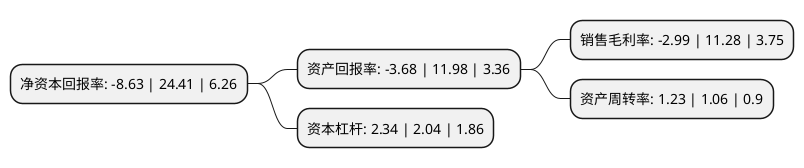

> 本页面由自动化程序生成于 2022年5月20日 01:08
> 内容可能存在错误，如有bug请提交issue至：https://github.com/Eroleice/doc-pi/issues
{.is-warning}

# 上市公司基本情况

## 基本资料

北京大北农科技集团股份有限公司（以下简称“大北农”）成立于1994年10月18日，北京市。于2010年04月09日在深交所中小板上市。

大北农注册资本414,128.185万元，主要产品:分为两类，一类是饲料及动物保健产品。另一类是种子及植物保护产品主营业务:饲料，种子产品的研发，生产，销售。以下是详细信息：

- 公司名称: 北京大北农科技集团股份有限公司
- 股票代码: 002385.SZ
- 所在地: 北京 - 北京市
- 成立日期: 1994年10月18日
- 注册资本: 414,128.185万元
- 法定代表人: 邵根伙
- 主营业务: 主要产品:分为两类，一类是饲料及动物保健产品另一类是种子及植物保护产品主营业务:饲料，种子产品的研发，生产，销售
- 公司官网: www.dbn.com.cn
- 公司介绍: 公司是国内规模最大的预混合饲料企业，产业涵盖畜牧科技与服务、种植科技与服务、农业互联网等领域，主要为养殖户和种植户提供高附加值的产品与服务。公司的产品主要包括畜禽饲料、兽药疫苗、种猪与作物种子、农药化肥及农业互联网与金融服务等。公司是国家级高新技术企业、农业产业化国家重点龙头企业、国家认证企业技术中心，国家创新型企业，目前已发展成为以饲料、种业为主体，动物保键、植物保护为辅的科技产业，以中国农民大学、农博网为两翼的农业知识产业。公司根据饲料和种子产品营销的特点建立了覆盖全国重点养殖和种植区域的营销网络。“金色农华”牌水稻种子被中国国家质量监督检验检疫总局评为“中国名牌”产品。

## 股东及高管情况

上市公司第一大股东为邵根伙，持股1,014,200,026股，占比24.49%，**疑似为**上市公司实际控制人。

截至2022年03月31日，上市公司的前十大股东中，共有5名自然人股东，4个产品账户，1个海外主体，其中5%以上大股东共有1名。上市公司前十大股东明细如下：

> 未能通过持股比例判定出上市公司实际控制人（持股30%以上）
> 可能存在通过间接持股、联合持股、协议控制等方式拥有实际控制权的主体，具体请参考上市公司定期公告！
{.is-warning}

> 截至2022年03月31日，上市公司前十大股东信息如下：

| 股东名称 | 持股数量（股） | 持股比例 |
| --- | --- | --- |
| 邵根伙 | 1,014,200,026 | 24.49% |
| 邱玉文 | 103,898,754 | 2.51% |
| 香港中央结算有限公司(陆股通) | 83,681,442 | 2.02% |
| 赵雁青 | 77,871,282 | 1.88% |
| 甄国振 | 44,216,904 | 1.07% |
| 李凤琴 | 43,278,414 | 1.05% |
| 华夏银行股份有限公司-万家瑞隆混合型证券投资基金 | 26,705,697 | 0.64% |
| 中国农业银行股份有限公司-银华内需精选混合型证券投资基金(LOF) | 25,100,000 | 0.61% |
| 浙商银行股份有限公司-国泰中证畜牧养殖交易型开放式指数证券投资基金 | 24,368,266 | 0.59% |
| 工银瑞信基金-农业银行-工银瑞信中证金融资产管理计划 | 23,469,000 | 0.57% |

## 杜邦分析

> 数据列示周期：2021年 | 2020年 | 2019年
{.is-info}

上市公司的净资产收益率在近一年有所下降，下降幅度为-135.35%，其变化情况分解如下：
- 上市公司的销售毛利率在近一年下降了-126.51%，可能是生产效率的下降、商品原材料价格上涨或商品价格的下跌所致。
- 上市公司的资产周转率在近一年上升了16.04%，可能是源自于更快的销售回款或库存管理效果提升。
- 上市公司的财务杠杆比率在近一年上升了14.71%，可能是增加负债扩大生产规模。

