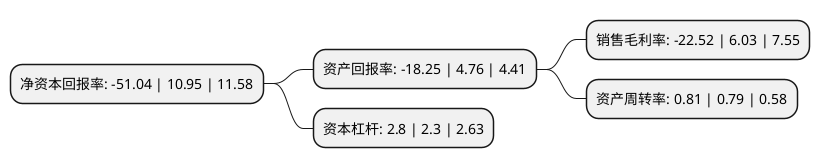

> 本页面由自动化程序生成于 2022年5月20日 01:10
> 内容可能存在错误，如有bug请提交issue至：https://github.com/Eroleice/doc-pi/issues
{.is-warning}

# 上市公司基本情况

## 基本资料

深圳市金新农科技股份有限公司（以下简称“金新农”）成立于1999年11月06日，深圳市。于2011年02月18日在深交所中小板上市。

金新农注册资本69,074.282万元，主营业务为猪饲料的研发，生产和销售，其中:教槽料和猪用浓缩料(含教槽浓缩料)的研发，生产和销售是公司的优势业务。产品主要包括:猪用配合料，猪用浓缩料，猪用预混料，产品覆盖了猪的各个不同生长阶段，其中:教槽料和猪用浓缩料(含教槽浓缩料)为公司的核心产品。以下是详细信息：

- 公司名称: 深圳市金新农科技股份有限公司
- 股票代码: 002548.SZ
- 所在地: 广东 - 深圳市
- 成立日期: 1999年11月06日
- 注册资本: 69,074.282万元
- 法定代表人: 郝立华
- 主营业务: 主营业务为猪饲料的研发，生产和销售，其中:教槽料和猪用浓缩料(含教槽浓缩料)的研发，生产和销售是公司的优势业务产品主要包括:猪用配合料，猪用浓缩料，猪用预混料，产品覆盖了猪的各个不同生长阶段，其中:教槽料和猪用浓缩料(含教槽浓缩料)为公司的核心产品
- 公司官网: www.kingsino.cn
- 公司介绍: 公司已发展成为主营业务涵盖全系猪用饲料研产销、种猪繁育、动保兽药、互联网通信技术等业务的中国现代化科技型集团公司、国家级高新技术企业，主要从事猪饲料的研发、生产与销售。公司已建立起“成农”和“轻松”品牌系列产品的金品质形象，充分满足了广大用户对猪不同生长阶段、不同层次和不同需求的营养需要。公司先后通过了ISO9001质量管理体系和HACCP食品安全管理体系认证。公司的经营规模、销售额、市场占有率均位居中国猪饲料生产企业前列。公司秉持“伙伴天下、共同成长”的核心价值观，以“科技兴农、行业典范”为使命，以“全情投入、持续卓越”为价值取向，在饲料业务领域精耕细作、成长壮大。

## 股东及高管情况

上市公司第一大股东为广州金农产业投资合伙企业(有限合伙)，持股250,699,507股，占比36.29%，为上市公司实际控制人。

截至2022年03月31日，上市公司的前十大股东中，共有2名自然人股东，2名机构股东，6个产品账户，其中5%以上大股东共有2名。上市公司前十大股东明细如下：

> 截至2022年03月31日，上市公司前十大股东信息如下：

| 股东名称 | 持股数量（股） | 持股比例 |
| --- | --- | --- |
| 广州金农产业投资合伙企业(有限合伙) | 250,699,507 | 36.29% |
| 舟山大成欣农股权投资合伙企业(有限合伙) | 44,803,549 | 6.49% |
| 中国工商银行股份有限公司-财通价值动量混合型证券投资基金 | 16,188,476 | 2.34% |
| 陈俊海 | 9,675,828 | 1.4% |
| 中国工商银行股份有限公司-财通内需增长12个月定期开放混合型证券投资基金 | 6,851,640 | 0.99% |
| 中国工商银行股份有限公司-财通成长优选混合型证券投资基金 | 6,275,510 | 0.91% |
| 中国工商银行股份有限公司-财通优势行业轮动混合型证券投资基金 | 6,268,670 | 0.91% |
| 中国建设银行股份有限公司-嘉实农业产业股票型证券投资基金 | 6,267,630 | 0.91% |
| 中国工商银行股份有限公司-财通科创主题3年封闭运作灵活配置混合型证券投资基金 | 5,980,970 | 0.87% |
| 蔡长兴 | 5,382,239 | 0.78% |

## 利润表分析

上市公司2021年总收入为48.67亿元，净利润为-10.97亿元，**未实现盈利**。

## 杜邦分析

> 数据列示周期：2021年 | 2020年 | 2019年
{.is-info}

上市公司的净资产收益率在近一年有所下降，下降幅度为-566.12%，其变化情况分解如下：
- 上市公司的销售毛利率在近一年下降了-473.47%，可能是生产效率的下降、商品原材料价格上涨或商品价格的下跌所致。
- 上市公司的资产周转率在近一年上升了2.53%，可能是源自于更快的销售回款或库存管理效果提升。
- 上市公司的财务杠杆比率在近一年上升了21.74%，可能是增加负债扩大生产规模。

