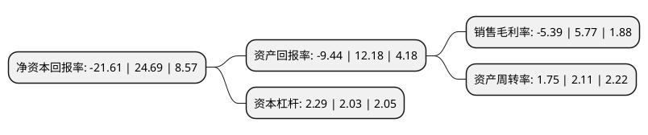

> 本页面由自动化程序生成于 2022年5月20日 01:10
> 内容可能存在错误，如有bug请提交issue至：https://github.com/Eroleice/doc-pi/issues
{.is-warning}

# 上市公司基本情况

## 基本资料

唐人神集团股份有限公司（以下简称“唐人神”）成立于1992年09月11日，株洲市。于2011年03月25日在深交所中小板上市。

唐人神注册资本120,601.754万元，饲料，肉品，种猪等的生产与销售，公司目前的产品包括饲料(猪饲料，禽饲料，水产饲料)，生鲜肉及各类肉制品，种猪，动物保健品等。以下是详细信息：

- 公司名称: 唐人神集团股份有限公司
- 股票代码: 002567.SZ
- 所在地: 湖南 - 株洲市
- 成立日期: 1992年09月11日
- 注册资本: 120,601.754万元
- 法定代表人: 陶一山
- 主营业务: 饲料，肉品，种猪等的生产与销售，公司目前的产品包括饲料(猪饲料，禽饲料，水产饲料)，生鲜肉及各类肉制品，种猪，动物保健品等
- 公司官网: www.trsgroup.com.cn
- 公司介绍: 公司是首批农业产业化国家重点龙头企业，致力生猪产业链一体化经营，经过多年的创业发展，已经形成了“品种改良、安全饲料、健康养殖、肉品加工、品牌专卖”五大产业发展格局，在全国拥有40余家子公司。集团旗下的“唐人神”、“骆驼”牌都是中国驰名商标，“唐人神”肉品和“骆驼”牌饲料都是中国名牌产品。“美神”种苗通过美国NSR认证，达到美国同步育种水平。集团位列饲料、肉类行业十强，跨入中国制造业500强。

## 股东及高管情况

上市公司第一大股东为湖南唐人神控股投资股份有限公司，持股140,629,910股，占比11.66%，**疑似为**上市公司实际控制人。

截至2022年03月31日，上市公司的前十大股东中，共有2名自然人股东，3名机构股东，4个产品账户，1个海外主体，其中5%以上大股东共有3名。上市公司前十大股东明细如下：

> 未能通过持股比例判定出上市公司实际控制人（持股30%以上）
> 可能存在通过间接持股、联合持股、协议控制等方式拥有实际控制权的主体，具体请参考上市公司定期公告！
{.is-warning}

> 截至2022年03月31日，上市公司前十大股东信息如下：

| 股东名称 | 持股数量（股） | 持股比例 |
| --- | --- | --- |
| 湖南唐人神控股投资股份有限公司 | 140,629,910 | 11.66% |
| 大生行饲料有限公司 | 98,106,200 | 8.13% |
| 湖南财信精信投资合伙企业(有限合伙) | 73,954,400 | 6.13% |
| 中国工商银行股份有限公司-财通价值动量混合型证券投资基金 | 29,294,750 | 2.43% |
| 香港中央结算有限公司(陆股通) | 20,858,839 | 1.73% |
| 王佐宇 | 19,400,000 | 1.61% |
| 中国工商银行-广发策略优选混合型证券投资基金 | 17,194,750 | 1.43% |
| 龙秋华 | 15,306,980 | 1.27% |
| 深圳德威资本投资管理有限公司-德威资本云源1号私募证券投资基金 | 14,143,257 | 1.17% |
| 深圳德威资本投资管理有限公司-德威资本云源2号私募证券投资基金 | 13,213,686 | 1.1% |

## 利润表分析

上市公司2021年总收入为217.42亿元，净利润为-11.73亿元，**未实现盈利**。

## 杜邦分析

> 数据列示周期：2021年 | 2020年 | 2019年
{.is-info}

上市公司的净资产收益率在近一年有所下降，下降幅度为-187.53%，其变化情况分解如下：
- 上市公司的销售毛利率在近一年下降了-193.41%，可能是生产效率的下降、商品原材料价格上涨或商品价格的下跌所致。
- 上市公司的资产周转率在近一年下降了-17.06%，可能是源自于更慢的销售回款或库存管理效果下降。
- 上市公司的财务杠杆比率在近一年上升了12.81%，可能是增加负债扩大生产规模。

