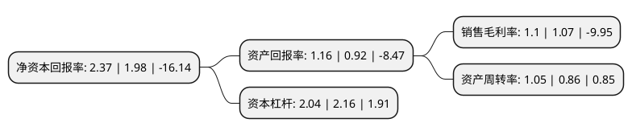

> 本页面由自动化程序生成于 2022年5月20日 01:11
> 内容可能存在错误，如有bug请提交issue至：https://github.com/Eroleice/doc-pi/issues
{.is-warning}

# 上市公司基本情况

## 基本资料

百洋产业投资集团股份有限公司（以下简称“百洋股份”）成立于2000年04月19日，南宁市。于2012年09月05日在深交所中小板上市。

百洋股份注册资本34,938.691万元，主营业务:冷冻罗非鱼产品的生产和销售，教育文化以下是详细信息：

- 公司名称: 百洋产业投资集团股份有限公司
- 股票代码: 002696.SZ
- 所在地: 广西 - 南宁市
- 成立日期: 2000年04月19日
- 注册资本: 34,938.691万元
- 法定代表人: 王建辉
- 主营业务: 主营业务:冷冻罗非鱼产品的生产和销售，教育文化
- 公司官网: www.baiyang.com
- 公司介绍: 公司是一家集水产科技研发、水产种苗选育、水产养殖、水产技术服务及水产饲料、水产食品、水产生物制品、水产即食菜品、美容保健品的生产、加工、出口和国内贸易为一体的农业产业化国家重点龙头企业，具备完整的水产产业链。公司拥有具备国际先进水平的水产食品、水产生物制品生产工艺设备和国内先进水平的水产饲料生产工艺设备，冷冻罗非鱼片、冷冻对虾等水产食品出口美国、俄罗斯、墨西哥、加拿大以及欧盟、中东等国家和地区。2017年，公司收购火星时代100%股权，火星时代主营业务为数字艺术教育，公司将涉足教育文化领域。

## 股东及高管情况

上市公司第一大股东为青岛海洋创新产业投资基金有限公司，持股58,881,390股，占比16.85%，**疑似为**上市公司实际控制人。

截至2022年03月31日，上市公司的前十大股东中，共有5名自然人股东，5个产品账户，其中5%以上大股东共有5名。上市公司前十大股东明细如下：

> 未能通过持股比例判定出上市公司实际控制人（持股30%以上）
> 可能存在通过间接持股、联合持股、协议控制等方式拥有实际控制权的主体，具体请参考上市公司定期公告！
{.is-warning}

> 截至2022年03月31日，上市公司前十大股东信息如下：

| 股东名称 | 持股数量（股） | 持股比例 |
| --- | --- | --- |
| 青岛海洋创新产业投资基金有限公司 | 58,881,390 | 16.85% |
| 青岛国信创新股权投资管理有限公司-青岛市海洋新动能产业投资基金(有限合伙) | 45,597,071 | 13.05% |
| 浙江宁聚投资管理有限公司-宁聚开阳11号私募证券投资基金 | 22,238,300 | 6.36% |
| 孙忠义 | 18,374,520 | 5.26% |
| 浙江宁聚投资管理有限公司-宁聚开阳12号私募证券投资基金 | 18,000,000 | 5.15% |
| 北信瑞丰基金-工商银行-富立天瑞华商投资管理有限公司-富立天瑞华商凤凰山六号私募投资基金 | 7,927,791 | 2.27% |
| 赵吉庆 | 5,660,000 | 1.62% |
| 杨君 | 5,015,991 | 1.44% |
| 徐思成 | 2,600,000 | 0.74% |
| 黄文博 | 2,505,400 | 0.72% |

## 利润表分析

上市公司2021年总收入为29.05亿元，净利润为0.32亿元，实现盈利。

## 杜邦分析

> 数据列示周期：2021年 | 2020年 | 2019年
{.is-info}

上市公司的净资产收益率在近一年有所上升，上升幅度为19.7%，其变化情况分解如下：
- 上市公司的销售毛利率在近一年上升了2.8%，可能是生产效率的提升、商品原材料价格下跌或商品价格的上涨所致。
- 上市公司的资产周转率在近一年上升了22.09%，可能是源自于更快的销售回款或库存管理效果提升。
- 上市公司的财务杠杆比率在近一年下降了-5.56%，可能是减少负债降低财务费用。

