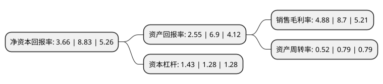

> 本页面由自动化程序生成于 2022年5月20日 01:19
> 内容可能存在错误，如有bug请提交issue至：https://github.com/Eroleice/doc-pi/issues
{.is-warning}

# 上市公司基本情况

## 基本资料

佩蒂动物营养科技股份有限公司（以下简称“佩蒂股份”）成立于2002年10月21日，温州市。于2017年07月11日在深交所创业板上市。

佩蒂股份注册资本25,341.12万元，是专业从事营养保健型，功能型宠物休闲食品研发，生产和销售的公司是专业从事营养保健型，功能型宠物休闲食品研发，生产和销售的高新技术企业，主要产品有畜皮咬胶，植物咬胶，营养肉质零食，可食用鸟食及小动物玩具，烘焙饼干等。以下是详细信息：

- 公司名称: 佩蒂动物营养科技股份有限公司
- 股票代码: 300673.SZ
- 所在地: 浙江 - 温州市
- 成立日期: 2002年10月21日
- 注册资本: 25,341.12万元
- 法定代表人: 陈振标
- 主营业务: 是专业从事营养保健型，功能型宠物休闲食品研发，生产和销售的公司是专业从事营养保健型，功能型宠物休闲食品研发，生产和销售的高新技术企业，主要产品有畜皮咬胶，植物咬胶，营养肉质零食，可食用鸟食及小动物玩具，烘焙饼干等
- 公司官网: www.peidibrand.com
- 公司介绍: 公司是目前我国宠物休闲食品领域最具规模和影响力的公司，也是中国检验检疫协会宠物分会副会长单位,国家标准《宠物食品-狗咬胶》的主持制定单位。作为专注从事宠物食品供应商以来，佩蒂一直遵循“诚信、创新、发展”的经营理念，坚持以“孜求不断满足并超越客户期望”作为企业质量管理方针，严格按照国际食品法规加工生产高品质的专业宠物零食产品，增进人与宠物的彼此关爱，领跑中国的宠物爱心事业。近几年来，企业先后获得“中国质量诚信企业”、“中礼协中国最具竞争力企业”、“中国宠物用品行业十强竞争力企业”、“浙江省出口重点扶持100家优秀企业”，“中国高新技术企业”等诸多荣誉。

## 股东及高管情况

上市公司第一大股东为陈振标，持股79,650,000股，占比31.43%，为上市公司实际控制人。

截至2022年03月31日，上市公司的前十大股东中，共有6名自然人股东，4个产品账户，其中5%以上大股东共有2名。上市公司前十大股东明细如下：

> 截至2022年03月31日，上市公司前十大股东信息如下：

| 股东名称 | 持股数量（股） | 持股比例 |
| --- | --- | --- |
| 陈振标 | 79,650,000 | 31.43% |
| 陈振录 | 30,542,400 | 12.05% |
| 郑香兰 | 8,100,000 | 3.2% |
| 陈林艺 | 6,548,100 | 2.58% |
| 江苏疌泉毅达融京股权并购投资基金(有限合伙) | 5,427,408 | 2.14% |
| 陈宝琳 | 5,262,450 | 2.08% |
| 林明霞 | 3,480,000 | 1.37% |
| 天虫资本管理有限公司-天虫蝉翼3号私募证券投资基金 | 1,840,300 | 0.73% |
| 天虫资本管理有限公司-天虫天赢远见2号私募证券投资基金 | 1,774,750 | 0.7% |
| 上海睿郡资产管理有限公司-睿郡睿享私募证券投资基金 | 1,747,470 | 0.69% |

## 利润表分析

上市公司2021年总收入为12.7亿元，净利润为0.62亿元，实现盈利。

## 杜邦分析

> 数据列示周期：2021年 | 2020年 | 2019年
{.is-info}

上市公司的净资产收益率在近一年有所下降，下降幅度为-58.55%，其变化情况分解如下：
- 上市公司的销售毛利率在近一年下降了-43.91%，可能是生产效率的下降、商品原材料价格上涨或商品价格的下跌所致。
- 上市公司的资产周转率在近一年下降了-34.18%，可能是源自于更慢的销售回款或库存管理效果下降。
- 上市公司的财务杠杆比率在近一年上升了11.72%，可能是增加负债扩大生产规模。

