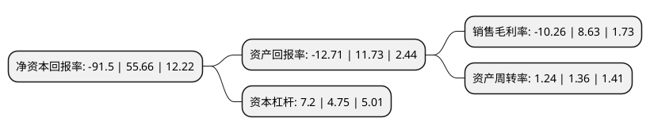

> 本页面由自动化程序生成于 2022年5月20日 01:34
> 内容可能存在错误，如有bug请提交issue至：https://github.com/Eroleice/doc-pi/issues
{.is-warning}

# 上市公司基本情况

## 基本资料

福建傲农生物科技集团股份有限公司（以下简称“傲农生物”）成立于2011年04月26日，漳州市。于2017年09月26日在上交所主板上市。

傲农生物注册资本68,441.579万元，主要业务:包括饲料，生猪养殖，兽药动保，原料贸易等核心产业，并搭建了猪OK猪场管理信息化系统，以下游客户养殖数据为基础，推进对下游客户的融资支持等全方位服务。主要产品:目前公司的主要产品为猪用饲料。以下是详细信息：

- 公司名称: 福建傲农生物科技集团股份有限公司
- 股票代码: 603363.SH
- 所在地: 福建 - 漳州市
- 成立日期: 2011年04月26日
- 注册资本: 68,441.579万元
- 法定代表人: 吴有林
- 主营业务: 包括饲料，生猪养殖，兽药动保，原料贸易等核心产业，并搭建了猪OK猪场管理信息化系统，以下游客户养殖数据为基础，推进对下游客户的融资支持等全方位服务主要产品:目前公司的主要产品为猪用饲料
- 公司官网: www.aonong.com.cn
- 公司介绍: 公司是一家以标准化、规范化、集约化和产业化为导向的高科技农牧企业，公司主营业务包括饲料、动保、养猪、原料贸易、农业互联网等产业。围绕“以饲料为核心的服务企业，以食品为导向的养猪企业”品牌定位，自成立以来，通过持续的技术创新、产品升级和品牌推广，竞争力不断增强，现已成为国内大型猪用饲料生产商之一。公司高度重视科研创新工作，组建有院士工作站、博士工作站、省级重点实验室、省级企业技术中心和省级企业工程技术研究中心等科研创新平台。集团及下属控股公司共拥有多项专利，公司同时亦是中国饲料工业协会副会长单位、中国畜牧业协会副会长单位。

## 股东及高管情况

上市公司第一大股东为厦门傲农投资有限公司，持股322,416,869股，占比39.07%，为上市公司实际控制人。

截至2022年05月06日，上市公司的前十大股东中，共有3名自然人股东，2名机构股东，5个产品账户，其中5%以上大股东共有4名。上市公司前十大股东明细如下：

> 截至2022年05月06日，上市公司前十大股东信息如下：

| 股东名称 | 持股数量（股） | 持股比例 |
| --- | --- | --- |
| 厦门傲农投资有限公司 | 322,416,869 | 39.07% |
| 厦门傲农投资有限公司 | 244,297,520 | 35.22% |
| 吴有林 | 105,479,292 | 12.78% |
| 吴有林 | 88,119,437 | 12.7% |
| 中国工商银行股份有限公司-财通价值动量混合型证券投资基金 | 17,092,356 | 2.46% |
| 黄祖尧 | 8,180,223 | 1.18% |
| 中国建设银行股份有限公司-嘉实农业产业股票型证券投资基金 | 5,742,925 | 0.83% |
| 中国农业银行股份有限公司-上投摩根新兴动力混合型证券投资基金 | 5,445,489 | 0.78% |
| 中国工商银行股份有限公司-嘉实主题新动力混合型证券投资基金 | 4,651,415 | 0.67% |
| 中国工商银行股份有限公司-财通科创主题3年封闭运作灵活配置混合型证券投资基金 | 4,489,230 | 0.65% |

## 利润表分析

上市公司2021年总收入为180.38亿元，净利润为-18.51亿元，**未实现盈利**。

## 杜邦分析

> 数据列示周期：2021年 | 2020年 | 2019年
{.is-info}

上市公司的净资产收益率在近一年有所下降，下降幅度为-264.39%，其变化情况分解如下：
- 上市公司的销售毛利率在近一年下降了-218.89%，可能是生产效率的下降、商品原材料价格上涨或商品价格的下跌所致。
- 上市公司的资产周转率在近一年下降了-8.82%，可能是源自于更慢的销售回款或库存管理效果下降。
- 上市公司的财务杠杆比率在近一年上升了51.58%，可能是增加负债扩大生产规模。

