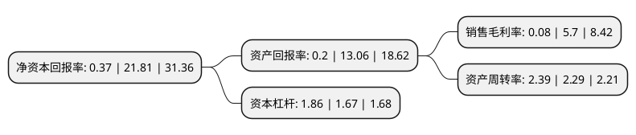

> 本页面由自动化程序生成于 2022年5月20日 01:34
> 内容可能存在错误，如有bug请提交issue至：https://github.com/Eroleice/doc-pi/issues
{.is-warning}

# 上市公司基本情况

## 基本资料

禾丰食品股份有限公司（以下简称“禾丰股份”）成立于2003年03月27日，沈阳市。于2014年08月08日在上交所主板上市。

禾丰股份注册资本92,196.02万元，饲料业务，原料贸易，屠宰加工，相关业务，其中饲料业务是主要业务。本公司饲料产品主要包括猪饲料，禽饲料，反刍料，水产料等。以下是详细信息：

- 公司名称: 禾丰食品股份有限公司
- 股票代码: 603609.SH
- 所在地: 辽宁 - 沈阳市
- 成立日期: 2003年03月27日
- 注册资本: 92,196.02万元
- 法定代表人: 金卫东
- 主营业务: 饲料业务，原料贸易，屠宰加工，相关业务，其中饲料业务是主要业务本公司饲料产品主要包括猪饲料，禽饲料，反刍料，水产料等
- 公司官网: www.wellhope-ag.com
- 公司介绍: 公司是中国东北最大的饲料企业集团，北方最大的农牧企业集团之一。公司主要业务包括饲料生产、肉禽产业化、饲料原料贸易及相关业务四大板块，同时涉猎生猪养殖、食品加工、宠物医疗等领域。公司的“仔猪健康养殖营养饲料调控技术及应用”项目获得国务院颁发的国家科学技术进步二等奖。禾丰目前拥有百余家下属企业，产品覆盖多个省市，并在朝鲜、尼泊尔、印尼、菲律宾、印度等国家设有分公司。公司是国家级农业产业化重点龙头企业，是中国饲料工业协会副会长单位，是中国最早通过ISO9001国际质量管理体系和HACCP食品安全管理体系双认证的饲料企业之一，“禾丰”商标是中国驰名商标。

## 股东及高管情况

上市公司第一大股东为金卫东，持股149,549,498股，占比16.22%，**疑似为**上市公司实际控制人。

截至2022年03月31日，上市公司的前十大股东中，共有7名自然人股东，1名机构股东，1个产品账户，1个海外主体，其中5%以上大股东共有8名。上市公司前十大股东明细如下：

> 未能通过持股比例判定出上市公司实际控制人（持股30%以上）
> 可能存在通过间接持股、联合持股、协议控制等方式拥有实际控制权的主体，具体请参考上市公司定期公告！
{.is-warning}

> 截至2022年03月31日，上市公司前十大股东信息如下：

| 股东名称 | 持股数量（股） | 持股比例 |
| --- | --- | --- |
| 金卫东 | 149,549,498 | 16.22% |
| DE HEUS MAURITIUS | 82,303,939 | 8.93% |
| 丁云峰 | 81,929,558 | 8.89% |
| 邵彩梅 | 49,773,878 | 5.4% |
| 常州禾力创业投资合伙企业(有限合伙) | 48,360,000 | 5.25% |
| 张铁生 | 48,360,000 | 5.25% |
| 王凤久 | 47,964,602 | 5.2% |
| 王仲涛 | 46,625,229 | 5.06% |
| 禾丰食品股份有限公司回购专用证券账户 | 20,956,579 | 2.27% |
| 王振勇 | 9,804,000 | 1.06% |

## 杜邦分析

> 数据列示周期：2021年 | 2020年 | 2019年
{.is-info}

上市公司的净资产收益率在近一年有所下降，下降幅度为-98.3%，其变化情况分解如下：
- 上市公司的销售毛利率在近一年下降了-98.6%，可能是生产效率的下降、商品原材料价格上涨或商品价格的下跌所致。
- 上市公司的资产周转率在近一年上升了4.37%，可能是源自于更快的销售回款或库存管理效果提升。
- 上市公司的财务杠杆比率在近一年上升了11.38%，可能是增加负债扩大生产规模。

