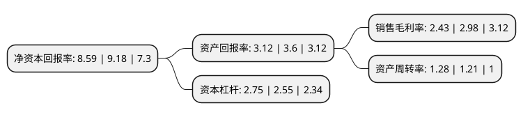

> 本页面由自动化程序生成于 2022年5月20日 01:35
> 内容可能存在错误，如有bug请提交issue至：https://github.com/Eroleice/doc-pi/issues
{.is-warning}

# 上市公司基本情况

## 基本资料

福建天马科技集团股份有限公司（以下简称“天马科技”）成立于2005年12月13日，福州市。于2017年01月17日在上交所主板上市。

天马科技注册资本43,616.473万元，主营业务:专业从事特种水产配合饲料研发，生产，销售。公司产品涵盖鳗鲡料，鳖料系列，海水鱼料系列(含石斑鱼，大黄鱼，鲆鲽鳎等)，淡水品种料系列(含鲟鱼，龟，黄颡鱼，黄鳝等)，虾料系列及种苗料系列5大系列。以下是详细信息：

- 公司名称: 福建天马科技集团股份有限公司
- 股票代码: 603668.SH
- 所在地: 福建 - 福州市
- 成立日期: 2005年12月13日
- 注册资本: 43,616.473万元
- 法定代表人: 陈庆堂
- 主营业务: 主营业务:专业从事特种水产配合饲料研发，生产，销售公司产品涵盖鳗鲡料，鳖料系列，海水鱼料系列(含石斑鱼，大黄鱼，鲆鲽鳎等)，淡水品种料系列(含鲟鱼，龟，黄颡鱼，黄鳝等)，虾料系列及种苗料系列5大系列
- 公司官网: www.jolma.cn
- 公司介绍: 公司是一家专业从事特种水产配合饲料研发、生产、销售的高新技术企业。公司生产的特种水产配合饲料产品主要应用于鳗鲡、石斑鱼、大黄鱼、龟、鳖、鲟鱼、鲑鳟、鲆鲽鳎、鲍、海参等特种水产动物从种苗期至养成期的人工养殖全阶段。经过多年自主创新及经验积累，公司已建立了专业、严谨的技术研发体系、质量控制体系、服务营销体系及内控管理体系，并迅速成长为农业产业化省级重点龙头企业。公司研发中心被评为福建省省级企业技术中心、福建省特种水产配合饲料企业工程技术研究中心，设有上海海洋大学博士后科研流动站工作基地、国家水生动物病原库研究生培养基地和鳗鲡现代产业技术教育部工程研究中心；公司“健马”牌水产配合饲料被国家质量监督检验检疫总局评为“中国名牌产品”，“健马”商标被国家工商行政管理总局评为“中国驰名商标”。

## 股东及高管情况

上市公司第一大股东为陈庆堂，持股86,557,557股，占比19.85%，**疑似为**上市公司实际控制人。

截至2022年04月28日，上市公司的前十大股东中，共有3名自然人股东，3名机构股东，3个产品账户，1个海外主体，其中5%以上大股东共有4名。上市公司前十大股东明细如下：

> 未能通过持股比例判定出上市公司实际控制人（持股30%以上）
> 可能存在通过间接持股、联合持股、协议控制等方式拥有实际控制权的主体，具体请参考上市公司定期公告！
{.is-warning}

> 截至2022年04月28日，上市公司前十大股东信息如下：

| 股东名称 | 持股数量（股） | 持股比例 |
| --- | --- | --- |
| 陈庆堂 | 86,557,557 | 19.85% |
| 陈庆堂 | 86,557,557 | 19.85% |
| 福建天马投资发展有限公司 | 54,353,026 | 12.46% |
| 福建天马投资发展有限公司 | 54,353,026 | 12.46% |
| 厦门夏商投资有限公司 | 13,793,103 | 3.16% |
| UBS AG | 9,167,274 | 2.1% |
| 大家人寿保险股份有限公司-万能产品 | 7,679,182 | 1.76% |
| 中国工商银行股份有限公司-诺安新经济股票型证券投资基金 | 7,351,871 | 1.69% |
| 林家兴 | 7,278,100 | 1.67% |
| 中国建设银行股份有限公司-嘉实农业产业股票型证券投资基金 | 6,222,340 | 1.43% |

## 利润表分析

上市公司2021年总收入为54.19亿元，净利润为1.31亿元，实现盈利。

## 杜邦分析

> 数据列示周期：2021年 | 2020年 | 2019年
{.is-info}

上市公司的净资产收益率在近一年有所下降，下降幅度为-6.43%，其变化情况分解如下：
- 上市公司的销售毛利率在近一年下降了-18.46%，可能是生产效率的下降、商品原材料价格上涨或商品价格的下跌所致。
- 上市公司的资产周转率在近一年上升了5.79%，可能是源自于更快的销售回款或库存管理效果提升。
- 上市公司的财务杠杆比率在近一年上升了7.84%，可能是增加负债扩大生产规模。

