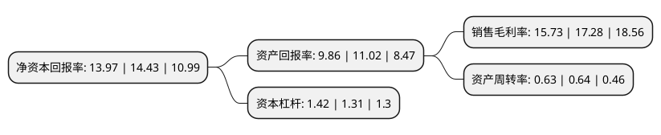

> 本页面由自动化程序生成于 2022年5月20日 01:04
> 内容可能存在错误，如有bug请提交issue至：https://github.com/Eroleice/doc-pi/issues
{.is-warning}

# 上市公司基本情况

## 基本资料

银泰黄金股份有限公司（以下简称“银泰黄金”）成立于1999年06月18日，锡林郭勒盟。于2000年06月08日在深交所主板上市。

银泰黄金注册资本277,672.227万元，主营业务:有色金属矿采选。以下是详细信息：

- 公司名称: 银泰黄金股份有限公司
- 股票代码: 000975.SZ
- 所在地: 内蒙古 - 锡林郭勒盟
- 成立日期: 1999年06月18日
- 注册资本: 277,672.227万元
- 法定代表人: 杨海飞
- 主营业务: 主营业务:有色金属矿采选
- 公司官网: www.ytg000975.com
- 公司介绍: 公司致力于有色金属、稀贵金属的勘探、采选销售及矿产资源行业的投资，拥有全国储量最大、单体银品位最高的银多金属矿。银泰资源资产质地优良，技术力量雄厚，已发展成为国内资源类具有重要影响力的上市公司。2016年11月，银泰资源收购了加拿大黄金生产和勘探商埃尔拉多黄金公司位于中国境内的黄金矿山资源，涉及矿山主要涵盖黑龙江黑河洛克矿业公司的东安金矿、吉林板庙子矿业公司的金英金矿及青海大柴旦矿业滩间山金矿，具体包括4个采矿权和9个探矿权，黄金储量丰富，品位普遍较高。此次收购完成，银泰资源获得了大量的高品位黄金资产和资源储备，进一步增强公司的竞争实力和抵御风险能力，进一步提升公司在有色金属行业的地位；大幅增加资产规模，进一步改善财务结构，提高盈利能力，将为全体股东创造更好的回报；获得国际先进的矿业技术和矿山管理经验、管理模式以及国际化人才队伍，为公司的可持续发展奠定基础。

## 股东及高管情况

上市公司第一大股东为王水，持股417,993,343股，占比15.05%，**疑似为**上市公司实际控制人。

截至2022年05月06日，上市公司的前十大股东中，共有5名自然人股东，3名机构股东，2个产品账户，其中5%以上大股东共有6名。上市公司前十大股东明细如下：

> 未能通过持股比例判定出上市公司实际控制人（持股30%以上）
> 可能存在通过间接持股、联合持股、协议控制等方式拥有实际控制权的主体，具体请参考上市公司定期公告！
{.is-warning}

> 截至2022年05月06日，上市公司前十大股东信息如下：

| 股东名称 | 持股数量（股） | 持股比例 |
| --- | --- | --- |
| 王水 | 417,993,343 | 15.05% |
| 中国银泰投资有限公司 | 401,060,950 | 14.44% |
| 中国银泰投资有限公司 | 401,060,950 | 14.44% |
| 程少良 | 191,398,510 | 6.89% |
| 程少良 | 191,398,510 | 6.89% |
| 沈国军 | 180,120,118 | 6.49% |
| 中国建设银行股份有限公司-华夏能源革新股票型证券投资基金 | 61,962,817 | 2.23% |
| 何艳 | 53,116,188 | 1.91% |
| 广州开发区控股集团有限公司 | 35,751,068 | 1.29% |
| 中国工商银行股份有限公司-华夏核心制造混合型证券投资基金 | 30,112,017 | 1.08% |

## 利润表分析

上市公司2021年总收入为90.4亿元，净利润为14.21亿元，实现盈利。

## 杜邦分析

> 数据列示周期：2021年 | 2020年 | 2019年
{.is-info}

上市公司的净资产收益率在近一年有所下降，下降幅度为-3.19%，其变化情况分解如下：
- 上市公司的销售毛利率在近一年下降了-8.97%，可能是生产效率的下降、商品原材料价格上涨或商品价格的下跌所致。
- 上市公司的资产周转率在近一年下降了-1.56%，可能是源自于更慢的销售回款或库存管理效果下降。
- 上市公司的财务杠杆比率在近一年上升了8.4%，可能是增加负债扩大生产规模。

