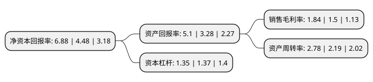

> 本页面由自动化程序生成于 2022年5月20日 01:06
> 内容可能存在错误，如有bug请提交issue至：https://github.com/Eroleice/doc-pi/issues
{.is-warning}

# 上市公司基本情况

## 基本资料

湖南黄金股份有限公司（以下简称“湖南黄金”）成立于2000年12月26日，长沙市。于2007年08月16日在深交所中小板上市。

湖南黄金注册资本120,203.947万元，主要产品;“辰州”牌黄金，精锑及三氧化二锑，钨精矿及仲钨酸铵等。主营业务:本公司(包括下属子公司)的主营业务为金锑钨及其共(伴)生矿的勘探，开采，冶炼和加工，以下是详细信息：

- 公司名称: 湖南黄金股份有限公司
- 股票代码: 002155.SZ
- 所在地: 湖南 - 长沙市
- 成立日期: 2000年12月26日
- 注册资本: 120,203.947万元
- 法定代表人: 王选祥
- 主营业务: 主要产品;“辰州”牌黄金，精锑及三氧化二锑，钨精矿及仲钨酸铵等主营业务:本公司(包括下属子公司)的主营业务为金锑钨及其共(伴)生矿的勘探，开采，冶炼和加工，
- 公司官网: www.hngoldcorp.com
- 公司介绍: 公司的本部沃溪矿区属我国早期主要的黄金生产基地之一，公司目前是国内十大黄金矿山开发企业之一，也是全球第二大开发锑矿和国内主要的开发钨矿的公司。公司集地质勘探、采、选、冶、运输、机械修造及金属深加工为一体，拥有国际领先的金锑选矿和冶炼精细分离技术。公司是上海黄金交易所综合类会员单位及标准金锭提供商和锑品、钨品出口供货资格及出口经营资格企业，拥有国家级的“质量检测管理中心”，先后被评为全国黄金行业先进单位，全国矿产资源合理开发利用先进矿山，获国家“绿色矿山”称号，是国家级“守合同重信用”企业。

## 股东及高管情况

上市公司第一大股东为湖南黄金集团有限责任公司，持股479,740,966股，占比39.91%，为上市公司实际控制人。

截至2022年03月31日，上市公司的前十大股东中，共有2名自然人股东，2名机构股东，5个产品账户，1个海外主体，其中5%以上大股东共有1名。上市公司前十大股东明细如下：

> 截至2022年03月31日，上市公司前十大股东信息如下：

| 股东名称 | 持股数量（股） | 持股比例 |
| --- | --- | --- |
| 湖南黄金集团有限责任公司 | 479,740,966 | 39.91% |
| 香港中央结算有限公司(陆股通) | 29,872,554 | 2.49% |
| 株洲市国有资产投资控股集团有限公司 | 22,844,719 | 1.9% |
| 中国建设银行股份有限公司-华泰柏瑞富利灵活配置混合型证券投资基金 | 15,911,727 | 1.32% |
| 林仁平 | 10,419,400 | 0.87% |
| 中国对外经济贸易信托有限公司-外贸信托-仁桥泽源股票私募证券投资基金 | 9,412,400 | 0.78% |
| 石日超 | 9,100,000 | 0.76% |
| 中信证券股份有限公司-前海开源金银珠宝主题精选灵活配置混合型证券投资基金 | 6,311,097 | 0.53% |
| 中国农业银行股份有限公司-汇添富中国高端制造股票型证券投资基金 | 5,099,964 | 0.42% |
| 中国农业银行股份有限公司-中证500交易型开放式指数证券投资基金 | 4,380,400 | 0.36% |

## 利润表分析

上市公司2021年总收入为198.45亿元，净利润为3.64亿元，实现盈利。

## 杜邦分析

> 数据列示周期：2021年 | 2020年 | 2019年
{.is-info}

上市公司的净资产收益率在近一年有所上升，上升幅度为53.57%，其变化情况分解如下：
- 上市公司的销售毛利率在近一年上升了22.67%，可能是生产效率的提升、商品原材料价格下跌或商品价格的上涨所致。
- 上市公司的资产周转率在近一年上升了26.94%，可能是源自于更快的销售回款或库存管理效果提升。
- 上市公司的财务杠杆比率在近一年下降了-1.46%，可能是减少负债降低财务费用。

