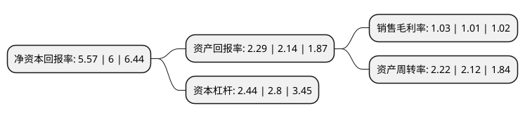

> 本页面由自动化程序生成于 2022年5月20日 01:07
> 内容可能存在错误，如有bug请提交issue至：https://github.com/Eroleice/doc-pi/issues
{.is-warning}

# 上市公司基本情况

## 基本资料

山东恒邦冶炼股份有限公司（以下简称“恒邦股份”）成立于1994年02月18日，烟台市。于2008年05月20日在深交所中小板上市。

恒邦股份注册资本114,801.44万元，黄金探，采，选，冶及化工生产等。以下是详细信息：

- 公司名称: 山东恒邦冶炼股份有限公司
- 股票代码: 002237.SZ
- 所在地: 山东 - 烟台市
- 成立日期: 1994年02月18日
- 注册资本: 114,801.44万元
- 法定代表人: 曲胜利
- 主营业务: 黄金探，采，选，冶及化工生产等
- 公司官网: www.hbyl.cn
- 公司介绍: 公司是高新技术企业，主要致力于金精矿、银精矿、铜精矿及含砷复杂矿的冶炼技术研究，综合回收和清洁生产水平已经达到国际领先。公司建有山东省企业技术中心、博士后创新实践基地、国家认可实验室及省市区级创新工作室等多个技术创新平台，还与东北大学、中南大学及中国恩菲工程技术有限公司建立了长期的产学研合作关系。公司先后被授予“全国黄金行业先进集体”、“山东省最具幸福感企业”、“山东省依靠职工办企事业先进单位”、“山东省现场管理样板企业”等多项国家级和省级荣誉称号。

## 股东及高管情况

上市公司第一大股东为江西铜业股份有限公司，持股510,643,360股，占比44.48%，为上市公司实际控制人。

截至2022年03月31日，上市公司的前十大股东中，共有5名自然人股东，3名机构股东，1个产品账户，1个海外主体，其中5%以上大股东共有2名。上市公司前十大股东明细如下：

> 截至2022年03月31日，上市公司前十大股东信息如下：

| 股东名称 | 持股数量（股） | 持股比例 |
| --- | --- | --- |
| 江西铜业股份有限公司 | 510,643,360 | 44.48% |
| 烟台恒邦集团有限公司 | 67,674,706 | 5.89% |
| 王信恩 | 23,677,300 | 2.06% |
| 王家好 | 11,925,000 | 1.04% |
| 香港中央结算有限公司(陆股通) | 10,250,535 | 0.89% |
| 王卫列 | 8,700,100 | 0.76% |
| 中信证券股份有限公司-前海开源金银珠宝主题精选灵活配置混合型证券投资基金 | 7,348,644 | 0.64% |
| 孙军 | 5,690,000 | 0.5% |
| 中航鑫港担保有限公司 | 5,478,800 | 0.48% |
| 刘纪鹏 | 5,420,700 | 0.47% |

## 利润表分析

上市公司2021年总收入为413.82亿元，净利润为4.26亿元，实现盈利。

## 杜邦分析

> 数据列示周期：2021年 | 2020年 | 2019年
{.is-info}

上市公司的净资产收益率在近一年有所下降，下降幅度为-7.17%，其变化情况分解如下：
- 上市公司的销售毛利率在近一年上升了1.98%，可能是生产效率的提升、商品原材料价格下跌或商品价格的上涨所致。
- 上市公司的资产周转率在近一年上升了4.72%，可能是源自于更快的销售回款或库存管理效果提升。
- 上市公司的财务杠杆比率在近一年下降了-12.86%，可能是减少负债降低财务费用。

