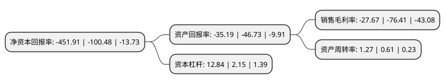

> 本页面由自动化程序生成于 2022年5月20日 01:25
> 内容可能存在错误，如有bug请提交issue至：https://github.com/Eroleice/doc-pi/issues
{.is-warning}

# 上市公司基本情况

## 基本资料

甘肃荣华实业(集团)股份有限公司（以下简称“*ST荣华”）成立于1998年11月12日，武威市。于2001年06月26日在上交所主板上市。

*ST荣华注册资本66,560万元，主营业务:黄金开采，加工与销售。。以下是详细信息：

- 公司名称: 甘肃荣华实业(集团)股份有限公司
- 股票代码: 600311.SH
- 所在地: 甘肃 - 武威市
- 成立日期: 1998年11月12日
- 注册资本: 66,560万元
- 法定代表人: 刘永
- 主营业务: 主营业务:黄金开采，加工与销售
- 公司官网: www.rong-hua.net
- 公司介绍: 公司原为一家粮食与饲料加工企业，公司被八部委确认为151户农业产业化国家重点龙头企业之一。2011年，公司加大了对原有的农产品加工类资产的处置力度，逐步降低农产品加工业务占公司主营业务的比重，积极致力于对公司发展战略的调整。近年来，公司主营业务收入主要来源于浙商矿业的黄金销售，主营黄金开采、加工、销售。浙商矿业下设采矿厂、选矿厂、冶炼厂和配套生产部门，设备齐全，生产线完善。生产所需矿石由企业自行开采，整体生产加工过程包括原矿的粗破-中细碎-筛分-磨矿-分级-浓缩-浸出吸附-解吸电解-金泥熔炼-尾矿压滤。完成后，委托西脉黄金股份有限公司加工成标准金后存入上海黄金交易所，并通过西脉黄金股份有限公司利用上海黄金交易所交易系统代理销售。

## 股东及高管情况

上市公司第一大股东为武威荣华工贸集团有限公司，持股107,650,000股，占比16.17%，**疑似为**上市公司实际控制人。

截至2022年03月31日，上市公司的前十大股东中，共有8名自然人股东，1名机构股东，1个产品账户，其中5%以上大股东共有1名。上市公司前十大股东明细如下：

> 未能通过持股比例判定出上市公司实际控制人（持股30%以上）
> 可能存在通过间接持股、联合持股、协议控制等方式拥有实际控制权的主体，具体请参考上市公司定期公告！
{.is-warning}

> 截至2022年03月31日，上市公司前十大股东信息如下：

| 股东名称 | 持股数量（股） | 持股比例 |
| --- | --- | --- |
| 武威荣华工贸集团有限公司 | 107,650,000 | 16.17% |
| 杭州嘉祺投资管理有限公司-嘉祺多策略2号私募证券投资基金 | 8,693,900 | 1.31% |
| 赵瑞祥 | 8,018,300 | 1.2% |
| 金雷 | 6,710,001 | 1.01% |
| 李会荣 | 6,619,331 | 0.99% |
| 高敏江 | 5,288,800 | 0.79% |
| 王昕宁 | 3,728,351 | 0.56% |
| 张丽艳 | 3,157,700 | 0.47% |
| 王建明 | 3,133,200 | 0.47% |
| 江蓉 | 3,036,400 | 0.46% |

## 利润表分析

上市公司2021年总收入为10.42亿元，净利润为-2.89亿元，**未实现盈利**。

## 杜邦分析

> 数据列示周期：2021年 | 2020年 | 2019年
{.is-info}

上市公司的净资产收益率在近一年有所上升，上升幅度为349.75%，其变化情况分解如下：
- 上市公司的销售毛利率在近一年下降了-63.79%，可能是生产效率的下降、商品原材料价格上涨或商品价格的下跌所致。
- 上市公司的资产周转率在近一年上升了108.2%，可能是源自于更快的销售回款或库存管理效果提升。
- 上市公司的财务杠杆比率在近一年上升了497.21%，可能是增加负债扩大生产规模。

