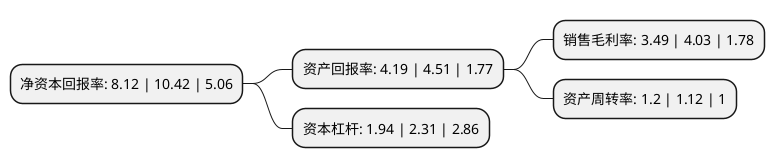

> 本页面由自动化程序生成于 2022年5月20日 01:26
> 内容可能存在错误，如有bug请提交issue至：https://github.com/Eroleice/doc-pi/issues
{.is-warning}

# 上市公司基本情况

## 基本资料

中金黄金股份有限公司（以下简称“中金黄金”）成立于2000年06月23日，北京市。于2003年08月14日在上交所主板上市。

中金黄金注册资本484,731.256万元，主要产品:黄金。以下是详细信息：

- 公司名称: 中金黄金股份有限公司
- 股票代码: 600489.SH
- 所在地: 北京 - 北京市
- 成立日期: 2000年06月23日
- 注册资本: 484,731.256万元
- 法定代表人: 卢进
- 主营业务: 主要产品:黄金
- 公司官网: zjgold.chinagoldgroup.com
- 公司介绍: 公司是集黄金采、选、冶、加工综合配套能力的大型黄金企业，生产有高纯金、标准金、电解银、电解铜和硫酸等多种产品。经营范围包括黄金、有色金属的地质勘查、采选、冶炼的投资与管理；黄金生产的副产品加工、销售；黄金生产技术的研究开发、咨询服务；高纯度黄金制品的生产、加工、批发；进出口业务；商品展销。中金黄金近年来高质量的健康发展，受到社会各界和资本市场高度瞩目和广泛赞誉。先后获得“全国五一劳动奖状”“中国证券市场20年最受投资者喜爱的上市公司”“中证回报百强”“中国上市公司市值管理百佳”“最佳股东回报上市公司”等多项荣誉。

## 股东及高管情况

上市公司第一大股东为中国黄金集团有限公司，持股2,221,816,774股，占比45.84%，为上市公司实际控制人。

截至2022年03月31日，上市公司的前十大股东中，共有2名自然人股东，5名机构股东，3个产品账户，其中5%以上大股东共有1名。上市公司前十大股东明细如下：

> 截至2022年03月31日，上市公司前十大股东信息如下：

| 股东名称 | 持股数量（股） | 持股比例 |
| --- | --- | --- |
| 中国黄金集团有限公司 | 2,221,816,774 | 45.84% |
| 中银资产基金管理有限公司-河南中鑫债转股私募股权投资基金(有限合伙) | 169,953,102 | 3.51% |
| 国新央企运营投资基金管理(广州)有限公司-国新央企运营(广州)投资基金(有限合伙) | 153,655,602 | 3.17% |
| 中国国新资产管理有限公司 | 153,655,602 | 3.17% |
| 北京东富国创投资管理中心(有限合伙) | 76,827,789 | 1.58% |
| 中国证券金融股份有限公司 | 68,716,969 | 1.42% |
| 农银金融资产投资有限公司 | 38,414,008 | 0.79% |
| 王梓旭 | 37,589,800 | 0.78% |
| 中央企业乡村产业投资基金股份有限公司 | 32,728,764 | 0.68% |
| 汪称意 | 20,820,000 | 0.43% |

## 杜邦分析

> 数据列示周期：2021年 | 2020年 | 2019年
{.is-info}

上市公司的净资产收益率在近一年有所下降，下降幅度为-22.07%，其变化情况分解如下：
- 上市公司的销售毛利率在近一年下降了-13.4%，可能是生产效率的下降、商品原材料价格上涨或商品价格的下跌所致。
- 上市公司的资产周转率在近一年上升了7.14%，可能是源自于更快的销售回款或库存管理效果提升。
- 上市公司的财务杠杆比率在近一年下降了-16.02%，可能是减少负债降低财务费用。

