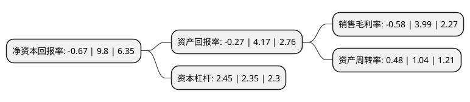

> 本页面由自动化程序生成于 2022年5月20日 01:27
> 内容可能存在错误，如有bug请提交issue至：https://github.com/Eroleice/doc-pi/issues
{.is-warning}

# 上市公司基本情况

## 基本资料

山东黄金矿业股份有限公司（以下简称“山东黄金”）成立于2000年01月31日，济南市。于2003年08月28日在上交所主板上市。

山东黄金注册资本447,342.953万元，主要业务:黄金开采，黄金珠宝饰品。以下是详细信息：

- 公司名称: 山东黄金矿业股份有限公司
- 股票代码: 600547.SH
- 所在地: 山东 - 济南市
- 成立日期: 2000年01月31日
- 注册资本: 447,342.953万元
- 法定代表人: 李国红
- 主营业务: 黄金开采，黄金珠宝饰品
- 公司官网: www.sdhjgf.com.cn
- 公司介绍: 公司是一家集采、选、冶于一体的大型上市公司，主要生产各种规格的投资金条和银锭等产品。公司生产经营主体为新城金矿、焦家金矿、玲珑金矿、三山岛金矿、沂南金矿、平度鑫汇金矿等多座国内外知名的大中型矿山。公司除拥有烟台、青岛、临沂、威海等地省内知名矿床的采矿权外，还通过兼并、收购等手段取得了内蒙古赤峰地区的采矿权，使公司保有黄金储量实现大幅增长。公司致力于打造国内黄金选冶“航母”，建成了国内首家万吨级选冶规模的选厂，日选冶能力得到成倍增长。公司不断引进国内外高新技术和科研成果，并逐步加大自主创新能力的培养和锻炼，通过博士后工作站“筑巢引凰”、与国内知名科研院校合作等方式，使人才培养和科研成果的转化工作得到进一步提速，率先在国内开展了超深井采矿技术、信息化矿山建设、黄金矿山安全管理体系、绿色矿山等课题研究，逐步完善了黄金开采、选冶、科研以及黄金精加工等产业链条。

## 股东及高管情况

上市公司第一大股东为香港中央结算(代理人)有限公司，持股858,723,122股，占比19.2%，**疑似为**上市公司实际控制人。

截至2022年03月31日，上市公司的前十大股东中，共有2名自然人股东，5名机构股东，1个产品账户，2个海外主体，其中5%以上大股东共有1名。上市公司前十大股东明细如下：

> 未能通过持股比例判定出上市公司实际控制人（持股30%以上）
> 可能存在通过间接持股、联合持股、协议控制等方式拥有实际控制权的主体，具体请参考上市公司定期公告！
{.is-warning}

> 截至2022年03月31日，上市公司前十大股东信息如下：

| 股东名称 | 持股数量（股） | 持股比例 |
| --- | --- | --- |
| 香港中央结算(代理人)有限公司 | 858,723,122 | 19.2% |
| 山东黄金地质矿产勘查有限公司 | 194,872,049 | 4.36% |
| 山东黄金有色矿业集团有限公司 | 115,477,482 | 2.58% |
| 香港中央结算有限公司(陆股通) | 112,902,065 | 2.52% |
| 中国证券金融股份有限公司 | 108,834,732 | 2.43% |
| 郭宏伟 | 33,000,000 | 0.74% |
| 山东黄金集团青岛黄金有限公司 | 31,467,157 | 0.7% |
| 山东省国有资产投资控股有限公司 | 25,028,941 | 0.56% |
| 王卫列 | 21,600,000 | 0.48% |
| 中国工商银行-广发稳健增长证券投资基金 | 20,500,000 | 0.46% |

## 利润表分析

上市公司2021年总收入为339.34亿元，净利润为-1.96亿元，**未实现盈利**。

## 杜邦分析

> 数据列示周期：2021年 | 2020年 | 2019年
{.is-info}

上市公司的净资产收益率在近一年有所下降，下降幅度为-106.84%，其变化情况分解如下：
- 上市公司的销售毛利率在近一年下降了-114.54%，可能是生产效率的下降、商品原材料价格上涨或商品价格的下跌所致。
- 上市公司的资产周转率在近一年下降了-53.85%，可能是源自于更慢的销售回款或库存管理效果下降。
- 上市公司的财务杠杆比率在近一年上升了4.26%，可能是增加负债扩大生产规模。

