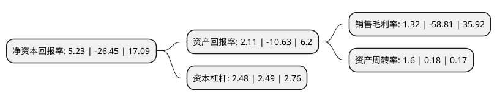

> 本页面由自动化程序生成于 2022年5月20日 01:28
> 内容可能存在错误，如有bug请提交issue至：https://github.com/Eroleice/doc-pi/issues
{.is-warning}

# 上市公司基本情况

## 基本资料

烟台园城黄金股份有限公司（以下简称“*ST园城”）成立于1994年06月17日，烟台市。于1996年10月28日在上交所主板上市。

*ST园城注册资本22,422.682万元，主营业务:托管黄金矿业业务以下是详细信息：

- 公司名称: 烟台园城黄金股份有限公司
- 股票代码: 600766.SH
- 所在地: 山东 - 烟台市
- 成立日期: 1994年06月17日
- 注册资本: 22,422.682万元
- 法定代表人: 徐成义
- 主营业务: 主营业务:托管黄金矿业业务
- 公司官网: www.ytycgf.com
- 公司介绍: 公司主营以托管黄金矿业业务为主，主要托管矿山有：乳山市金海矿业、本溪小套峪矿业。公司坚持采取并购、托管等方式拓展矿产资源的储备，保证公司低成本的优势。以矿产资源的开发为核心业务打造公司的管理团队，同时对矿产资源进行技改等手段确保公司矿产资源能够实现低成本、高技术、高收益的开发模式。

## 股东及高管情况

上市公司第一大股东为徐诚东，持股64,640,000股，占比28.83%，**疑似为**上市公司实际控制人。

截至2022年03月31日，上市公司的前十大股东中，共有8名自然人股东，2个产品账户，其中5%以上大股东共有1名。上市公司前十大股东明细如下：

> 未能通过持股比例判定出上市公司实际控制人（持股30%以上）
> 可能存在通过间接持股、联合持股、协议控制等方式拥有实际控制权的主体，具体请参考上市公司定期公告！
{.is-warning}

> 截至2022年03月31日，上市公司前十大股东信息如下：

| 股东名称 | 持股数量（股） | 持股比例 |
| --- | --- | --- |
| 徐诚东 | 64,640,000 | 28.83% |
| 葛章词 | 9,772,116 | 4.36% |
| 钱伟阳 | 5,400,900 | 2.41% |
| 深圳润城投资管理有限公司-润城问君成长1号私募证券投资基金 | 3,436,300 | 1.53% |
| 马敏 | 2,823,900 | 1.26% |
| 林文锻 | 2,455,500 | 1.1% |
| 深圳含金量私募证券投资基金管理有限公司-含金量盛世尊享私募证券投资基金 | 2,238,700 | 1% |
| 李学文 | 1,978,200 | 0.88% |
| 孙凤菊 | 1,950,000 | 0.87% |
| 陈一青 | 1,783,100 | 0.8% |

## 利润表分析

上市公司2021年总收入为2.25亿元，净利润为0.02亿元，实现盈利。

## 杜邦分析

> 数据列示周期：2021年 | 2020年 | 2019年
{.is-info}

上市公司的净资产收益率在近一年有所下降，下降幅度为-119.77%，其变化情况分解如下：
- 上市公司的销售毛利率在近一年下降了-102.24%，可能是生产效率的下降、商品原材料价格上涨或商品价格的下跌所致。
- 上市公司的资产周转率在近一年上升了788.89%，可能是源自于更快的销售回款或库存管理效果提升。
- 上市公司的财务杠杆比率在近一年下降了-0.4%，可能是减少负债降低财务费用。

