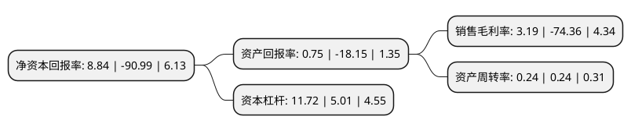

> 本页面由自动化程序生成于 2022年5月20日 01:29
> 内容可能存在错误，如有bug请提交issue至：https://github.com/Eroleice/doc-pi/issues
{.is-warning}

# 上市公司基本情况

## 基本资料

济南高新发展股份有限公司（以下简称“济南高新”）成立于1993年01月16日，济南市。于1994年01月03日在上交所主板上市。

济南高新注册资本88,463.473万元，主要业务:房地产+商业。以下是详细信息：

- 公司名称: 济南高新发展股份有限公司
- 股票代码: 600807.SH
- 所在地: 山东 - 济南市
- 成立日期: 1993年01月16日
- 注册资本: 88,463.473万元
- 法定代表人: 贾为
- 主营业务: 房地产+商业
- 公司官网: www.jngxfz.com
- 公司介绍: 公司前身为山东济南百货大楼(集团)股份有限公司,原是具有五十多年发展历史的国有商业企业。2014年，公司实施了发行股份购买资产并募集配套资金重大资产重组，主营业务由百货经营为主向营利能力较强的“房地产+商业”转型。公司成为山东省房地产业上市公司之一。公司先后获得济南房地产品牌企业、济南房地产企业综合实力20强、山东省房地产开发50强、综合信用评定AAA企业，山东民营企业100强、中国房地产开发企业500强、省工商企业免检单位、统计工作先进单位、最具社会责任感品牌等多项殊荣。

## 股东及高管情况

上市公司第一大股东为济南高新城市建设发展有限公司，持股142,307,521股，占比16.09%，**疑似为**上市公司实际控制人。

截至2022年03月31日，上市公司的前十大股东中，共有10名机构股东，其中5%以上大股东共有2名。上市公司前十大股东明细如下：

> 未能通过持股比例判定出上市公司实际控制人（持股30%以上）
> 可能存在通过间接持股、联合持股、协议控制等方式拥有实际控制权的主体，具体请参考上市公司定期公告！
{.is-warning}

> 截至2022年03月31日，上市公司前十大股东信息如下：

| 股东名称 | 持股数量（股） | 持股比例 |
| --- | --- | --- |
| 济南高新城市建设发展有限公司 | 142,307,521 | 16.09% |
| 山东天业房地产开发集团有限公司 | 60,500,530 | 6.84% |
| 国通信托有限责任公司 | 44,011,700 | 4.98% |
| 济南高新智慧谷投资置业有限公司 | 28,426,938 | 3.21% |
| 济南东拓置业有限公司 | 11,678,800 | 1.32% |
| 济南东信开发建设有限公司 | 10,755,700 | 1.22% |
| 济南高新控股集团有限公司 | 10,732,455 | 1.21% |
| 济南东瓴发展投资开发有限公司 | 10,164,101 | 1.15% |
| 将军控股有限公司 | 9,959,802 | 1.13% |
| 济南高新临空经济区园区开发有限公司 | 9,817,300 | 1.11% |

## 杜邦分析

> 数据列示周期：2021年 | 2020年 | 2019年
{.is-info}

上市公司的净资产收益率在近一年有所下降，下降幅度为-109.72%，其变化情况分解如下：
- 上市公司的销售毛利率在近一年下降了-104.29%，可能是生产效率的下降、商品原材料价格上涨或商品价格的下跌所致。
- 上市公司的资产周转率在近一年下降了0%，可能是源自于更慢的销售回款或库存管理效果下降。
- 上市公司的财务杠杆比率在近一年上升了133.93%，可能是增加负债扩大生产规模。

