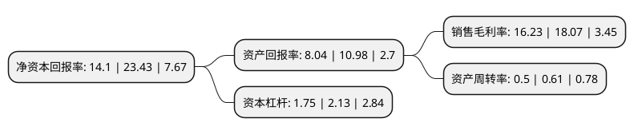

> 本页面由自动化程序生成于 2022年5月20日 01:30
> 内容可能存在错误，如有bug请提交issue至：https://github.com/Eroleice/doc-pi/issues
{.is-warning}

# 上市公司基本情况

## 基本资料

赤峰吉隆黄金矿业股份有限公司（以下简称“赤峰黄金”）成立于1998年06月22日，赤峰市。于2004年04月14日在上交所主板上市。

赤峰黄金注册资本166,391.138万元，主要从事黄金采选及资源综合回收利用业务，主要产品为黄金，白银，铋，钯，铑等多种稀贵金属。以下是详细信息：

- 公司名称: 赤峰吉隆黄金矿业股份有限公司
- 股票代码: 600988.SH
- 所在地: 内蒙古 - 赤峰市
- 成立日期: 1998年06月22日
- 注册资本: 166,391.138万元
- 法定代表人: 王建华
- 主营业务: 主要从事黄金采选及资源综合回收利用业务，主要产品为黄金，白银，铋，钯，铑等多种稀贵金属
- 公司官网: www.600988.com.cn
- 公司介绍: 公司是A股主板上市公司，股票代码600988。公司位于内蒙古赤峰市境内，主要从事黄金采选及资源综合回收利用业务，主要产品为黄金、白银、铋、钯、铑等多种稀贵金属。公司注重法人治理，坚持规范运营，在注重经济效益、以丰厚的业绩回报社会及广大投资者的同时，更加注重社会效益、企业文化发展及生态文明建设，积极承担社会责任。公司将通过不断创新管理机制，坚持低成本运营，加大对黄金资源的收购整合力度，推动黄金企业规模化、集约化发展，大力开展资源综合回收利用和其他环保技术的推广和应用，实现资源的有效利用、合理开发，借助国家“一带一路”政策，立足国内，放眼世界，努力打造国内先进、国际知名的黄金矿业上市公司。

## 股东及高管情况

上市公司第一大股东为李金阳，持股186,117,395股，占比11.19%，**疑似为**上市公司实际控制人。

截至2022年03月31日，上市公司的前十大股东中，共有4名自然人股东，5个产品账户，1个海外主体，其中5%以上大股东共有3名。上市公司前十大股东明细如下：

> 未能通过持股比例判定出上市公司实际控制人（持股30%以上）
> 可能存在通过间接持股、联合持股、协议控制等方式拥有实际控制权的主体，具体请参考上市公司定期公告！
{.is-warning}

> 截至2022年03月31日，上市公司前十大股东信息如下：

| 股东名称 | 持股数量（股） | 持股比例 |
| --- | --- | --- |
| 李金阳 | 186,117,395 | 11.19% |
| 王建华 | 98,170,771 | 5.9% |
| 王建华 | 98,170,771 | 5.9% |
| 香港中央结算有限公司(陆股通) | 55,220,571 | 3.32% |
| 全国社保基金一一八组合 | 52,418,940 | 3.15% |
| 北京盘庚资本管理有限公司-盘庚价值2号私募证券投资基金 | 41,597,732 | 2.5% |
| 中国建设银行股份有限公司-华夏能源革新股票型证券投资基金 | 38,243,578 | 2.3% |
| 常刚 | 28,108,855 | 1.69% |
| 中国农业银行股份有限公司-大成新锐产业混合型证券投资基金 | 27,634,606 | 1.66% |
| 中国工商银行股份有限公司-华夏核心制造混合型证券投资基金 | 21,820,131 | 1.31% |

## 杜邦分析

> 数据列示周期：2021年 | 2020年 | 2019年
{.is-info}

上市公司的净资产收益率在近一年有所下降，下降幅度为-39.82%，其变化情况分解如下：
- 上市公司的销售毛利率在近一年下降了-10.18%，可能是生产效率的下降、商品原材料价格上涨或商品价格的下跌所致。
- 上市公司的资产周转率在近一年下降了-18.03%，可能是源自于更慢的销售回款或库存管理效果下降。
- 上市公司的财务杠杆比率在近一年下降了-17.84%，可能是减少负债降低财务费用。

